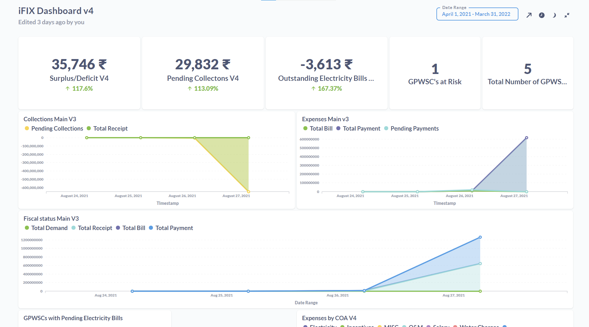

# Introducing Public Finance Management (iFIX)

## Mission

Enable governments to continuously improve their financial health, ensure a functioning and responsive service delivery system, and deploy available funds in ways that create an environment for businesses, communities, and individuals to prosper and stay healthy.

## Overview

iFIX is an open-source fiscal information exchange platform. The platform enables connected applications to exchange standardised fiscal events e.g. Demand, Receipts, Bills, and Payments. The fiscal event consists of attributes explaining the details of why, who, what, where and when it happened.&#x20;

### Need For iFIX

As government service delivery requires multiple actors and interactions to come together across different levels, visibility of information is critical to bring down the cost of coordination. This includes real-time information on the financial health of a government agency/department- expenditure, revenue and availability of funds.

Public finance management faces significant challenges in terms of promoting accountability and transparency. The problem is more on account of siloed information structures that restrict the scope to get a broader view of the flow of funds or data across agencies and stakeholders.&#x20;

<figure><figcaption></figcaption></figure>

The flow of information is both slow and limited, resulting in a number of gaps and breaks in the PFM processes. This is essentially attributed to the lack of information standards and exchange mechanisms that make it difficult for the seamless flow of data across agencies.

<figure><figcaption></figcaption></figure>

iFIX allows departments to share fiscal information from existing systems without having to invest in multiple integrations for different stakeholder requirements. The platform plays a pivotal role in driving efficient and performance-driven financial planning across all levels of governance. Real-time availability of financial information to stakeholders facilitates data-driven deployment of public funds and policy-making. The platform specification sets the base for the real-time exchange of fiscal information across funding and implementing agencies.

<figure><figcaption></figcaption></figure>

### Platform Scope

The iFIX platform identifies and resolves Public Financial Management issues like delays in funds flow, floating of unutilised funds, problems of low data fidelity,  the administrative burden of implementation and outcome-oriented funding using the platform approach and associated policy reforms.&#x20;

<figure><figcaption></figcaption></figure>

The platform helps achieve overall fiscal discipline, allocation of resources to priority needs, efficient and effective allocation of public services. Public financial management includes all phases of the budget cycle, including the preparation of the budget, internal control and audit, procurement, monitoring and reporting arrangements, and external audit.&#x20;

iFIX helps address the following challenges with respect to the information on government fiscal programmes&#x20;

* Unlocking fiscal and operational data locked in silos&#x20;
* Generating relevant information based on common data standards&#x20;
* Ensuring the information generated is credible, reliable and verifiable&#x20;
* Accelerating fund flows by providing trusted, usable data and reducing the interdepartmental coordination time

The present-day public finance system supports multiple types of information flows that are unique and accessed by multiple sources. iFIX simplifies the network and fiscal information flows through the use of standardised formats and protocols.

### Benefits

**No change to the source system:** Enabling information exchange through iFIX does not necessitate any change to the source systems, therefore ensuring minimal disruption to current ways of working.&#x20;

**Scalability across governance levels and geographies:** iFIX approach for standardisation can be applied to multiple entities at the same level and across different levels. This gives the platform infinite applicability within the PFM context to provide visibility on aggregated and disaggregated information.

## Objectives

The standardised fiscal event and exchange mechanism enable various government agencies e.g. various departments, local governments, autonomous bodies, national government, and development agencies to -

* exchange fiscal data much like email systems exchange data with each other
* ease flow of fiscal information resulting in better planning, better execution, better accounting and better auditing thus transforming the entire PFM cycle
* promote transparency and improve accountability while ensuring real-time access to the financial health of the government stakeholders

## Approach

iFIX offers a platform that standardises fiscal event data and the capabilities to exchange information across multiple sources. The platform is built as a digital public good and is open source with minimal specifications. The design incorporates the security and privacy of all data and users and ensures performance at scale.

<figure><figcaption></figcaption></figure>

Data standards streamline the flow of information paving the way for timely exchange and cost-effective means of managing fiscal events. The iFIX platform establishes the standards and specifications for fiscal event data that make it easier to exchange fiscal information between funding and implementing agencies. Event data is captured in real-time and at the micro level which ensures there is no intentional or unintentional data loss. Any transaction triggers a fiscal event that is accessible to integrated agencies for necessary approvals.&#x20;

**The standardized data exchange platform approach ensures that iFIX is not a replacement for the existing finance system. It is just a coordination and visibility layer between agencies within government and across governments.**

Visit the [Products pages](exemplar/) to learn more about the iFIX platform capabilities.

## Useful Links


[release-notes](platform/release-notes/)



[installation](platform/installation/)



[configuration](platform/configuration/)



[exemplar](exemplar/)


## Contact Us



