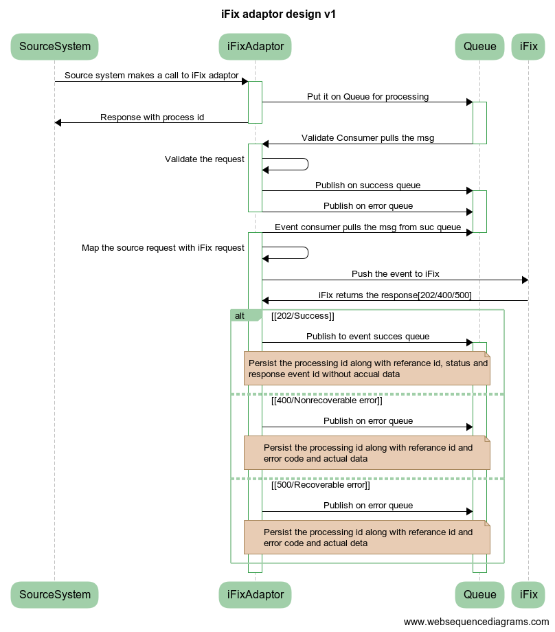

# mGramSeva iFIX Adapter Service

## Overview 

Ifix-Adapter is a system that works as a mediator between iFIX and its clients. This system will receive requests from the client system and convert the data in the iFIX required format This document contains the details on how to set up the iFIX-adapter service and describes the functionalities it supports. It supports multiple events (Event Array) in a single request.

## Pre-requisites 

Before you proceed with the configuration, make sure the following pre-requisites are met -

* _Java 8_
* Kafka server is up and running
* PSQL server is running
* Redis
* Following services should be up and running:
  * Client Service Like mgramseva-ifix-adapter
  * Target service IFIX- fiscal-event-service
  * Target Service IFIX-keycloak
  * Adapter master data service

## Key Functionalities 

* IFIX client requests are pushed to IFIX.
* The authentication token is fetched from keycloak and cached. Token is re-fetched 5 minutes before expiry.
* project\_id from request data is getting treated as Department Entity Code to fetch Department Entity.
* COA Code fetched from COA Mapping table by client code and cached it in Redis Server.
* Every push to IFIX is recorded in the table with HTTP status
  * status series 200 considered success
  * status 400 are marked client error
* It collects projectId form request data and treats it as department\_entity\_code and calls search API to Department Entity Service. It always expects it will receive only one Department Entity against a single department\_entity\_code, if it finds multiple raise an error message.
* One project can have multiple department entities but vice-versa cannot be true. In case of multiple projects for one department entity - the system will raise an error message.

## Deployment Details 

Deploy the latest version of the ifix-reference-adapter.

| **Environment Variables**                                          | **Description**                                                                                                                     |
| ------------------------------------------------------------------ | ----------------------------------------------------------------------------------------------------------------------------------- |
| `kafka.topics.ifix.adaptor.mapper`                                 | Topic in which client requests are put. From this further listen and posting happens                                                |
| `keycloak.host`                                                    | 
Host name of the key cloak authentication token provider

 
                                                             |
| `keycloak.token.url`                                               | key cloak authentication token url                                                                                                  |
| `keycloak.credentials.clientid`                                    | userid of for authentication token                                                                                                  |
| `keycloak.credentials.clientsecret`                                | password for authentication token                                                                                                   |
| `ifix.host`                                                        | host name of IFIX server                                                                                                            |
| `ifix.event.url`                                                   | IFIX post URL                                                                                                                       |
| `spring.redis.host`                                                | Host name of the redis server                                                                                                       |
| `state.goverment.code`                                             | 
top level tenant id of the client

 
                                                                                    |
| `spring.jpa.properties.hibernate.dialect`                          | dialect for JPA. you can change this to oracle or my sql etc                                                                        |
| `spring.jpa.properties.hibernate.jdbc.lob.non_contextual_creation` | will generate the required tables in the respective database . This feature is used instead of flyway to get database in-dependency |

## Configuration Details 

1. Update Key cloak credentials in dev.yaml,qa.yaml,prod.yaml according to the environment The credentials are “`keycloak.credentials.clientid` and “`keycloak.credentials.clientsecret`” Example is given in [here](https://github.com/egovernments/iFix-DevOps/blob/27c67ad236f06ad2e6a139c4d59111db184f8705/deploy-as-code/helm/environments/mgramseva-qa.yaml#L224) and [here](https://github.com/egovernments/iFix-DevOps/blob/27c67ad236f06ad2e6a139c4d59111db184f8705/deploy-as-code/helm/environments/mgramseva-qa-secrets.yaml#L65)
2. Map **clientcode**, **ifixcoacode**, **ifixid** in **ifix\_adapter\_coa\_map** table
   * “clientcode” is the tax head like “WATER\_CHARGES” or ‘10011’ used in IFIX client like mgramseva
   * “ifixcoacode” is the 16 digit glcode in IFIX. 16 digit code is mapped then this can be ported to any environment like dev to qa ,or qa to uat or from uat to prod. Prefer mapping ifixcoacode
   * example is INSERT INTO public.ifix\_adapter\_coa\_map(id, clientcode, ifixcoacode, ifixid, tenantid)\
     VALUES (1,'10101', '0215-01-102-00-00-01', '6cbcb4a1-2431-4f78-89d7-b4f0565aba37', 'pb');
3. `state.goverment.code` set this value to the clients top level tenant\_id

### Interaction Diagram 

## &#x20;Reference Docs

### Doc Links 

| <h4 id="title"><strong>Title</strong> </h4> | **Link**                                                                                                                                                                                              |
| ------------------------------------------- | ----------------------------------------------------------------------------------------------------------------------------------------------------------------------------------------------------- |
| Api Swagger document                        | 
<a href="https://redocly.github.io/redoc/?url=https://raw.githubusercontent.com/misdwss/iFix-Dev/master/reference-adapter/iFix-adapter-v1.0.yaml#tag/Event">ReDoc Interactive Demo</a>

 
 |
| Postman                                     | [https://www.getpostman.com/collections/6bac883e1965f298e96b](https://www.getpostman.com/collections/6bac883e1965f298e96b)                                                                            |

### API List

| **API**          | **Description**                                                                     |
| ---------------- | ----------------------------------------------------------------------------------- |
| events/v1/\_push | Api for receiving data from client (mgram). This is the only api present in adapter |

&#x20;

> [_​_](http://creativecommons.org/licenses/by/4.0/)_All content on this page by_ [_eGov Foundation_](https://egov.org.in/) _is licensed under a_ [_Creative Commons Attribution 4.0 International License_](http://creativecommons.org/licenses/by/4.0/)_._
