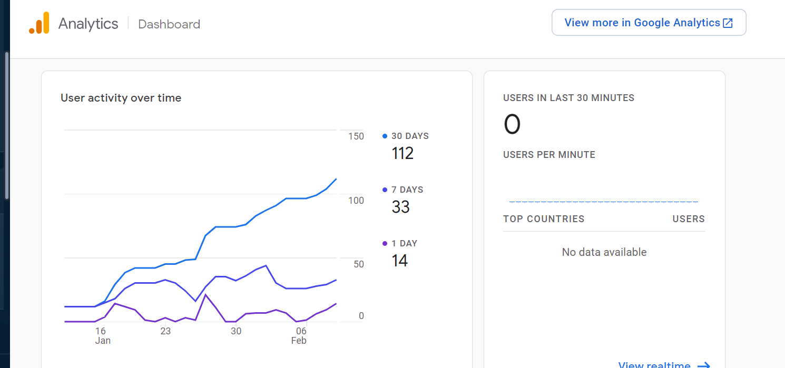

# Firebase Analytics Integration

Google Analytics **helps you understand how people use the web and Android apps**. Analytics helps you understand how your users behave, so we can make informed decisions about how to market our app.

**Plugin used**

`firebase_analytics`

**About Firebase Console**

In the Firebase console we can track the real-time user usage, Below are the main core features for tracking the user

* Users in the last 30 minutes.
* User's activity over time using a date picker represents inline charts.
* Track the users by app version.
* Track users by device Model.
* User Retention.

### **Reference Links**

[Firebase Analytics](https://firebase.flutter.dev/docs/analytics/overview/)

### **Files Path**

[punjab-mgramseva/main.dart at master · misdwss/punjab-mgramseva](https://github.com/misdwss/punjab-mgramseva/blob/master/frontend/mgramseva/lib/main.dart)&#x20;

[punjab-mgramseva/index.html at master · misdwss/punjab-mgramseva](https://github.com/misdwss/punjab-mgramseva/blob/master/frontend/mgramseva/web/index.html)&#x20;

[punjab-mgramseva/google-services.json at master · misdwss/punjab-mgramseva](https://github.com/misdwss/punjab-mgramseva/blob/master/frontend/mgramseva/android/app/google-services.json)

> [_​_](http://creativecommons.org/licenses/by/4.0/)_All content on this page by_ [_eGov Foundation_](https://egov.org.in/) _is licensed under a_ [_Creative Commons Attribution 4.0 International License_](http://creativecommons.org/licenses/by/4.0/)_._
