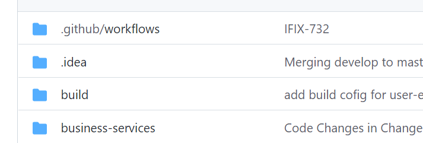

# Integration Testing With Github Actions

## **About Git Actions**


GitHub Actions enables you to create custom software development lifecycle workflows\
directly in your GitHub repository. This enables you to include Continues\
Integration (CI) and continuous deployment (CD) capabilities. it easier to automate how you build, test,\
and deploy your projects on any platform, including Linux, macOS, and Windows.\
Run your workflows in a virtual machine and local machine as well.

### &#x20;**Why Use Git Action**

* It is easy to build the app in artefacts.
* Analyze, Build, Test and Deploy our applications on any platform.
* Easily release the app bundle in the Play store.
* The speed of GitHub Actions is good

### **Reference link**

* [GitHub Actions Documentation - GitHub Docs](https://docs.github.com/en/actions)
* [Github Actions for Flutter](https://medium.com/mobile-development-group/github-actions-for-flutter-cf02923d7b5d)
* [About self-hosted runners - GitHub Docs](https://docs.github.com/en/actions/hosting-your-own-runners/about-self-hosted-runners)

### **File Path**

Primary Files [punjab-mgramseva/languageSelection.dart at develop · egovernments/punjab-mgramseva](https://github.com/egovernments/punjab-mgramseva/blob/develop/frontend/mgramseva/lib/screeens/SelectLanguage/languageSelection.dart)

## **Integrating GitHub Actions in Project**



* Every command will be written in yml files and all these files will be in .github/workflows/ directory\
  of your repository, then only git will identify our script files.
* In our repository we are maintaining this file as main.yml, In this yml file we are executing the android drive job, which will run the integration testing scripts, once all the tests are passed then only it will build the app in QA ENV and store it in the artefacts as shown image.
* Explained every line of main.yml file with comments below.

```

# Name of your workflow.
name: integration-test

# Trigger the workflow on push or pull requests.
on:
  push:
    branches: [ IFIX-732 ]

# A workflow run is made up of one or more jobs.
jobs:
  # id of job, a string that is unique to the "jobs" node above.
  drive_android:
    # The type of machine to run the job on.
    runs-on: ubuntu-latest
    # Creates a build matrix for your jobs. You can define different
    # variations of an environment to run each job in.
    strategy:
      # A set of different configurations of the virtual  
      # environment.
      matrix:
        api-level: [ 30 ]
        target: [ default ]
    # Contains a sequence of tasks.
    steps:
      # The branch or tag ref that triggered the workflow will be 
      # checked out.
      - uses: actions/checkout@v2
      # Sets up a java environment.
      - uses: actions/setup-java@v1
        with:
          java-version: '1.8.x'
      # Sets up a Flutter environment.
      - uses: subosito/flutter-action@v1
        with:
          flutter-version: '2.5.2'
          channel: 'stable'
      - name: "Run Flutter Driver tests"
        #Operation for installing, configuring and running Android emulator
        # https://github.com/marketplace/actions/android-emulator-runner
        uses: reactivecircus/android-emulator-runner@v2
        with:
          api-level: ${{ matrix.api-level }}
          target: ${{ matrix.target }}
          arch: x86_64
          profile: Nexus 6
          script: "cd ./frontend/mgramseva && flutter drive  --dart-define=BASE_PATH=https://mgramseva-qa.egov.org.in/
          --driver=test_driver/integration_test_driver.dart   --target=integration_test/login_test.dart"
      # checking out to respective directory and building the apk
      - name: "flutter pub get"
        run: cd ./frontend/mgramseva && flutter build apk
      # uploading the release build to artifact
      - uses: actions/upload-artifact@v1
        with:
          name: release-apk
          path: frontend/mgramseva/build/app/outputs/apk/release/app-release.apk
```

## Integrating self-hosted runners <a href="#integrating-self-hosted-runners" id="integrating-self-hosted-runners"></a>

### **About Self-hosted runner**

We can host your own runners and customize the environment used to run jobs in your GitHub Actions workflows.

Self-hosted runners can be physical, virtual, in a container, on-premises, or in a cloud.

With self-hosted runners, you can choose to create a custom hardware configuration with more processing power or memory to run larger jobs, install software available on your local network, and choose an operating system not offered by GitHub-hosted runners.

### **Integrating self-hosted Runner with Local Machine**

* On [GitHub.com](http://github.com/), navigate to the main page of the repository.
*   Under your repository name, click  **Settings** as shown in the image.

    
* In the left sidebar, click **Actions**.
* In the left sidebar, under "Actions", click **Runners**.
* Click **New self-hosted runner**
* Select the operating system image and architecture of your self-hosted runner machine.
* You will see instructions showing you how to download the runner application and install it on your self-hosted runner machine.
* After completing the steps to add a self-hosted runner, the runner and its status are now listed under "Runners".
* Now you will have to edit the main.yaml file for using our local machine, replace the runs on with `self-hosted` as shown below.

`runs-on: ubuntu-latest` >> `runs-on: self-hosted`

### **Reference Link**

[Adding self-hosted runners - GitHub Docs](https://docs.github.com/en/actions/hosting-your-own-runners/adding-self-hosted-runners)


> [_​_](http://creativecommons.org/licenses/by/4.0/)_All content on this page by_ [_eGov Foundation_](https://egov.org.in/) _is licensed under a_ [_Creative Commons Attribution 4.0 International License_](http://creativecommons.org/licenses/by/4.0/)_._
