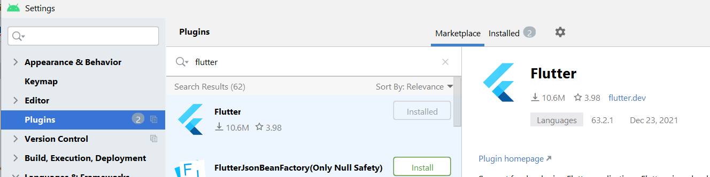
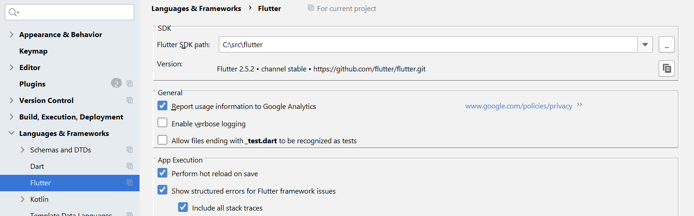
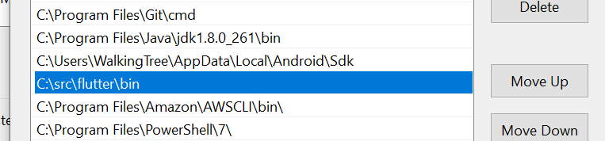
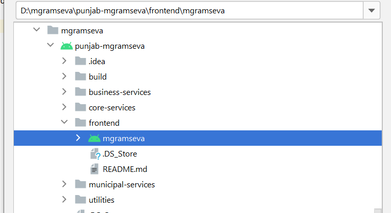
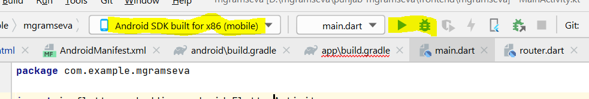
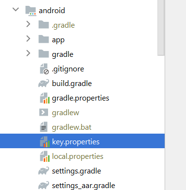
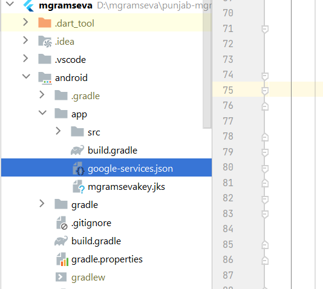

# Application Permissions & Dependencies

Make sure the below-mentioned Permissions are Allowed or Accepted:

1. Internet Access
2. FileStore Read and Write
3. Bluetooth connection
4. Request Packages
5. Query all packages

## **Code snippet**

```
<uses-permission android:name="android.permission.INTERNET"/>
<uses-permission android:name="android.permission.WRITE_EXTERNAL_STORAGE"></uses-permission>
<uses-permission android:name="android.permission.READ_EXTERNAL_STORAGE"></uses-permission>
<uses-permission android:name="android.permission.REQUEST_INSTALL_PACKAGES" />
<uses-permission android:name="android.permission.QUERY_ALL_PACKAGES"/>
```

[punjab-mgramseva/pubspec.yaml at develop · egovernments/punjab-mgramseva](https://github.com/egovernments/punjab-mgramseva/blob/develop/frontend/mgramseva/pubspec.yaml)

## Steps to setup the Project  <a href="#steps-to-setup-the-project" id="steps-to-setup-the-project"></a>

Download the flutter sdk [2.8.1](https://storage.googleapis.com/flutter\_infra\_release/releases/stable/windows/flutter\_windows\_2.8.1-stable.zip) from [Flutter SDK releases](https://docs.flutter.dev/development/tools/sdk/releases)

Install [Android Studio](https://developer.android.com/studio?gclid=Cj0KCQiAoNWOBhCwARIsAAiHnEhdk4OIpKE17YONk6ivWbnEFDrc5RKLxJpYQldYx2v6E714Lb5W-jEaAnTHEALw\_wcB\&gclsrc=aw.ds) for setting the IDE.

Open Android Studio, Open plugin preferences (**File > Settings > Plugins**) and select **Marketplace**, select the Flutter plugin and click **Install** as shown in the below image and also click **Yes** when prompted to install the Dart plugin.



Set the Flutter SDK path in android studio by navigating to (**File > Settings > Plugins > Language & Frameworks >>flutter**) flutter as shown in the image below.



Add the flutter path to the System path variable for running the flutter commands as shown in the below image.



Open a new terminal and run the **flutter doctor** command, this will download the respective Dart sdk version, run **flutter doctor --android-licenses** to accept the android licenses.

The steps below will guide us to run the project in both Web and Mobile\
1\. Clone the project from [Git repo](https://github.com/misdwss/punjab-mgramseva).\
2\. Open the project in android studio by selecting (**File > open**), select the flutter project (punjab-mgramseva/frontend/mgramseva) from the cloned path as shown in the image below.



## **Running on Android Emulator**

Select the AVD manager from the right side top corner as shown in the image. Now, select any device by tapping on the play button. Thus, the Android studio launches the emulator and the device is auto-selected. There are two modes for running the application - play and debug. Tap on any one of the modes to launch the mgramseva application in the emulator as shown in the image.



## **Running on Web**

Select the chrome option from device selection and tap on the play button. This launches the application on a chrome window.

Note: To resolve cors error follow the steps provided in this [link.](https://stackoverflow.com/questions/65630743/how-to-solve-flutter-web-api-cors-error-only-with-dart-code)\


## **Steps to Build Prod App Bundle**

1. &#x20;Clone the Repo → git clone [GitHub - misdwss/punjab-mgramseva](https://github.com/misdwss/punjab-mgramseva.git)
2. Navigate to mgramseva Folder → cd punjab-mgramseva/frontend/mgramseva
3.  .upgrading the version in the [pubspec.yml](https://github.com/misdwss/punjab-mgramseva/blob/master/frontend/mgramseva/pubspec.yaml) ( version: 1.0.2+3)\
    1.0.2 => version name (which displayed in playstore)

    \+3 => version code (increment by +1 every time)
4. Replace the base Url with Prod Url.\
   File → [app.config.dart](https://github.com/misdwss/punjab-mgramseva/blob/master/frontend/mgramseva/lib/Env/app\_config.dart)\
   \_baseUrl: window.location.origin + "/", =>    \_baseUrl:  "[mgramseva](https://mgramseva-dwss.punjab.gov.in/) "
5. Comment the below line\
   File → [link](https://github.com/misdwss/punjab-mgramseva/blob/master/frontend/mgramseva/lib/components/HouseConnectionandBill/jsconnnector.dart)\
   export 'dart:js' show allowInterop, allowInteropCaptureThis;
6. Executing flutter clean command →    **flutter clean**
7. Execute the flutter pub get command. →  **flutter pub get**
8. Download the key-store from the below link \
   [https://drive.google.com/file/d/14teTA0nqHaFLEkgg\_LCHTcji5cRJDnXR/view?usp=sharing - Restricted link, try another account](https://drive.google.com/file/d/14teTA0nqHaFLEkgg\_LCHTcji5cRJDnXR/view?usp=sharing)\
   Add this properties file to the android app folder as shown in below image\
   **android → key.properties** 
9. Download the google service json from below link\
   [google-services.json](https://drive.google.com/file/d/1USBY0a2sluHh2VwWxVcKhR7nzjkYnAmW/view?usp=sharing)\
   Add this json file to the android app folder as shown in below image\
   **android → app → google-services.json** 
10. Build the prod app bundle → **flutter build appbundle**\
    Kindly check the attached drive link below which includes key-store, version tracker and also updated the version and release date in the sheet.\
    Path → **D:\mgramseva\_prod\punjab-mgramseva\frontend\mgramseva\build\app\outputs\bundle\release\app-release.aab**\
    [https://docs.google.com/spreadsheets/d/1aH596FxtPISIlQzxw9jO\_Ex1dttpJJvweib2F9nJj9o/edit#gid=0 - Restricted link, try another account](https://docs.google.com/spreadsheets/d/1aH596FxtPISIlQzxw9jO\_Ex1dttpJJvweib2F9nJj9o/edit#gid=0)



## **Steps to Run the Integration Test in your Android Device**

1\. Enable the USB debugging option on your Mobile Phone. ([Reference Link](https://www.howtogeek.com/129728/how-to-access-the-developer-options-menu-and-enable-usb-debugging-on-android-4.2/) )

2\. Connect your Phone to the system and enable File transfer.

3\. Select the AVD manager(your Phone) from the right side top corner in Android Studio

4\. Go to the frontend/mgramseva/utils/execute\_integration.sh file and run it.

5\. Integration test will start on your device.


> [_​_](http://creativecommons.org/licenses/by/4.0/)_All content on this page by_ [_eGov Foundation_](https://egov.org.in/) _is licensed under a_ [_Creative Commons Attribution 4.0 International License_](http://creativecommons.org/licenses/by/4.0/)_._
