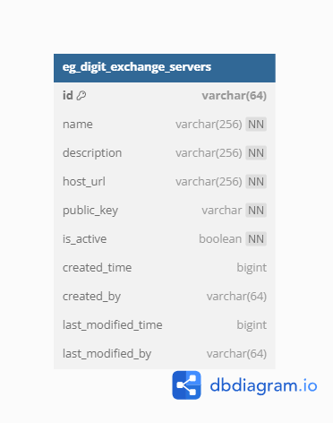
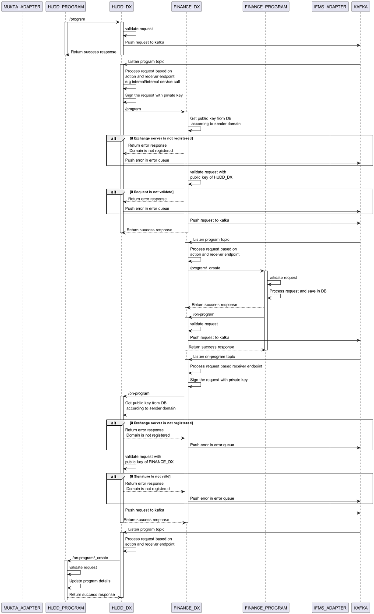

# DIGIT Exchange

## Overview

The DIGIT Exchange Service is a robust data interchange platform designed to facilitate the seamless and secure exchange of digital information between two endpoints. Built with a fixed schema for headers and dynamic messaging capabilities, this service ensures reliable communication while prioritizing data integrity and confidentiality.

### Dependencies

DIGIT-exchange can implement any service if that has the same request structure as the program.

* [Program Service](program-service.md)

## API Specifications

**Base Path:** /digit-exchange/

### API Contract Link

API spec [YAML is here.](https://raw.githubusercontent.com/egovernments/DIGIT-Specs/ifix-v2.2/Common%20Services/digit-exchange.yaml) Click below to view it in Swagger Editor.

{% embed url="https://editor.swagger.io/?url=https://raw.githubusercontent.com/egovernments/DIGIT-Specs/ifix-v2.2/Common%20Services/digit-exchange.yaml" %}

### APIs

{% swagger src="https://raw.githubusercontent.com/egovernments/DIGIT-Specs/ifix-v2.2/Common%20Services/digit-exchange.yaml" path="/exchange/EXCHANGE_TYPE" method="post" %}
[https://raw.githubusercontent.com/egovernments/DIGIT-Specs/ifix-v2.2/Common%2520Services/digit-exchange.yaml](https://raw.githubusercontent.com/egovernments/DIGIT-Specs/ifix-v2.2/Common%20Services/digit-exchange.yaml)


## High-Level Design

#### Exchange Flow

<figure><figcaption></figcaption></figure>

## Data Model&#x20;

### DB Schema Diagram

<figure><figcaption></figcaption></figure>

## Web Sequence Diagrams

#### Sequence of exchange between two environments

<figure><figcaption>
Exhcnage between two enviornments
</figcaption></figure>

#### Exchange Service example of an exchange

<figure><figcaption></figcaption></figure>

## Postman Collections

TBD

