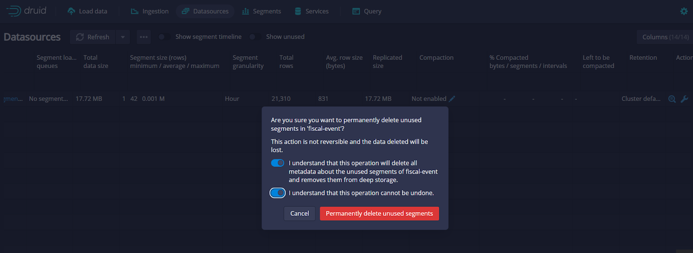

# iFIX Core Data Cleanup

## Overview

This page provides details on the steps involved in cleaning up the iFIX core data from various environments. Follow the instructions specific to select environment listed below.

* Druid Data Clean-Up&#x20;
* Mongo DB Data Clean-Up
* Postgres Data Clean-Up process.

## **Druid Data Clean-up**

* Open the druid console in the respective environment.
* Go to _**Ingestion** _ → _**Supervisors**_. And select the particular supervisor (_**fiscal-event**_)
  1. In _**Action**_, click on _**Terminate**._ This terminates the supervisor. Wait for a minute.
* Go to _**DataSources**_ and select the particular data source name (_**fiscal-event**_). And scroll down to _Action._
  1. Click on the _**Mark as unused all segments** → **Mark as unused all segments**._

.png>)

* Click on _**Delete unused segments (issue kill task)**_ and enable the permission to delete.



Once the clean-up process is completed, follow the instructions here -[ IFIX Fiscal Event Post Processor | Druid-Sink](broken-reference) to run the supervisor.

## &#x20;**MongoDB Data Clean-up**

* Connect to the playground pod and run the command below to connect with mongo DB. mongo --host _\<mongo-db-host>_:_\<mongo-db-port>_ -u _\<mongo-db-username>_ -p _\<mongo-db-password>_
* Use the _ifix core DB;_ use \<db name>
* Run the below command to delete all the data from _**fiscal\_event**_ collection. db.fiscal\_event.remove({});
* If you want to delete all fiscal event records of a particular Gram Panchayat then run the command below.

Here let us assume, we have to delete "LODHIPUR" GP (Gram Panchayat) details (that is hierarchy level 6) in the DWSS department. Run the command below.

```
db.fiscal_event.remove({"departmentEntity.ancestry.6.name":{$eq:"LODHIPUR"}});
```

* If you want to delete a fiscal event record based on some other attributes, you have to write a custom mongo delete query.

## **PostgresDB Data Clean-up** <a href="#postgresdb-data-clean-up" id="postgresdb-data-clean-up"></a>

*   Connect to the playground pod and run the below command to connect with postgresDB.&#x20;

    _psql -h \<psql-host> -p \<psql-port> -d \<psql-database> -U \<psql-username>_
* It prompts for a password. Enter the password.
* Run the below query to delete all the data from _**fiscal\_event\_aggregated**_.

```
DELETE FROM fiscal_event_aggregated;
```

* If you want to delete the particular Gram Panchayat details from fiscal event aggregated record, run the query below.

Here let us assume, we want to delete "LODHIPUR" GP (Gram Panchayat) details (that is hierarchy level 6) in the DWSS department.

```
DELETE FROM fiscal_event_aggregated where departmentEntity_ancestry_6_name='LODHIPUR';
```


**Note:** If you are not sure about deleting the fiscal event aggregated record, you can delete all the records from the fiscal\_event\_aggregated table. Once the records are deleted, either run the fiscal event aggregate Cron Job manually to UpSert all the records or the system UpSerts the records every midnight from Druid to Postgres.



> [_​_](http://creativecommons.org/licenses/by/4.0/)_All content on this page by_ [_eGov Foundation_](https://egov.org.in/) _is licensed under a_ [_Creative Commons Attribution 4.0 International License_](http://creativecommons.org/licenses/by/4.0/)_._


&#x20;
