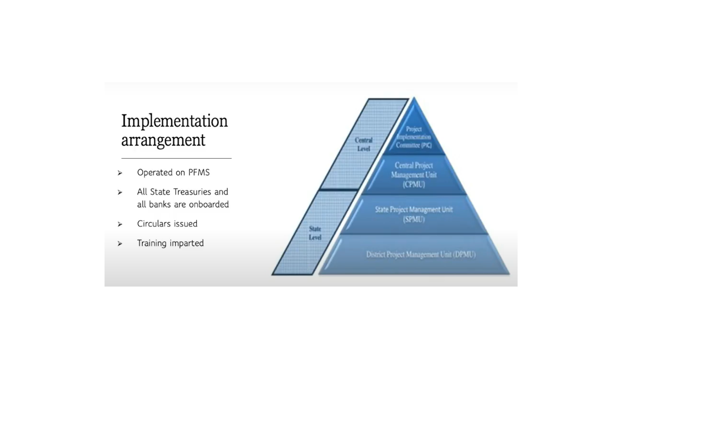
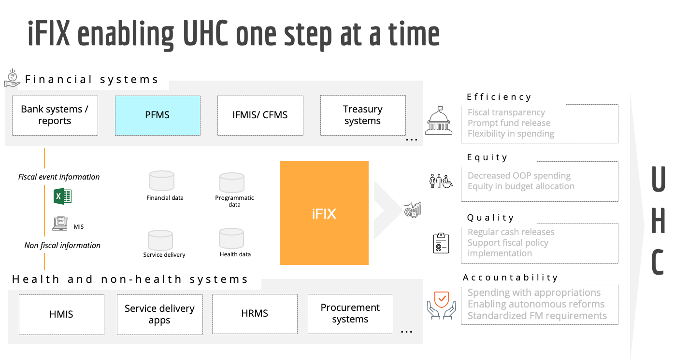

# Functional Specifications


Make sure to read this in conjunction with the following documents:

1. [iFIX Bluebook](https://docs.google.com/document/d/1r0QuzqAeXPo6LV7\_iLSg8o00cGHbUkNBTGBpV5LZff8/edit?usp=sharing\_eil\_m\&ts=6274fd59)
2. [iFIX Pitch Deck](https://docs.google.com/presentation/d/1jkAmJh4earuxp2a3YUU1e103eS0JeBMJjxsLgBMyssA/edit#slide=id.g1175e360844\_0\_16)
3. [iFIX Website ](https://pfm.digit.org/)


## Overview

This page provides the details of the fiscal event-based approach for building out iFIX as an information exchange platform. These details are used to define the technical specifications for iFIX and the functional specifications that are open for validation and inputs internally and from the ecosystem.

## Abbreviations & Common Terms

<table data-header-hidden><thead><tr><th width="139"></th><th></th></tr></thead><tbody><tr><td>AD</td><td>Administrative Department</td></tr><tr><td>ADFA</td><td>Assistant Director, Finance &#x26; Accounts</td></tr><tr><td>BCO</td><td>Budget Controlling Officer</td></tr><tr><td>BFC</td><td>Budget Finalisation Committee</td></tr><tr><td>BE</td><td>Budget Estimate</td></tr><tr><td>COA</td><td>Chart of Accounts</td></tr><tr><td>CS</td><td>Central Sector Schemes</td></tr><tr><td>CSS</td><td>Centrally Sponsored Schemes</td></tr><tr><td>DDO</td><td>Drawing &#x26; Disbursement Officer</td></tr><tr><td>DPR</td><td>Detailed Project Report</td></tr><tr><td>DWSS</td><td>Department of Water Supply and Sanitation</td></tr><tr><td>FD</td><td>Finance Department</td></tr><tr><td>FFC</td><td>Fifteenth Finance Commission</td></tr><tr><td>HoD</td><td>Head of the Department</td></tr><tr><td>IFMS</td><td>Integrated Financial Management System</td></tr><tr><td>RE</td><td>Revised Estimate</td></tr><tr><td>SNA</td><td>Single Nodal Account</td></tr><tr><td>SPS</td><td>State Plan Schemes</td></tr></tbody></table>

## Scope

The specifications have been defined from the lens of a sub-national government (state in the current context) and will be limited to interactions from a financial information perspective. The interactions in the scope of the current draft are:

1. State Finance Department (FD) and Central (National) Government
2. State Finance Department (FD) and [Line Department(s)](#user-content-fn-1)[^1]\[1] at state
3. State Line Department’s interactions with other line departments
4. State Line Department’s interactions with government autonomous bodies including local government and/or non-government agencies

The current draft of specifications was built using publicly available information and inputs from the Department of Water Supply and Sanitation (DWSS), Punjab, and the Finance Department, Punjab.

Financial information-related interactions of the Central Government with other Central Line Departments are out of the scope of the current draft.

For further details on the context of this document and our approach to reimagining Public Finance Management please refer to the [Bluebook](https://docs.google.com/document/d/1r0QuzqAeXPo6LV7\_iLSg8o00cGHbUkNBTGBpV5LZff8/edit?usp=sharing\_eil\_m\&ts=6274fd59).

## Fiscal Events-Based Approach&#x20;

The broad objective of iFIX is to enable the flow of reliable and verifiable fiscal information in a timely manner. Recognizing the multiplicity of unique types of information flows in the current PFM system, iFIX aims at simplifying this network of information flow. The key driver of this simplification will be the use of standardised formats for fiscal information exchange. To arrive at a crystallised set of formats and protocols covering all fiscal information exchanges following steps have been followed&#x20;

* **Step 1** - Define what is a fiscal event (and its types) or what is the scope of relevant fiscal information from an iFIX perspective (refer to [Fiscal Events Based Approach](./#fiscal-events-based-approach) section)&#x20;
* **Step 2** - Document the current public finance management processes at a generic level, i.e. defined using actors, verbs, inputs and outputs to ensure they are representative of all minor variants of the process at the level of various sub-national governments in India. (refer to tables in [Inferring Fiscal Events from As-is-Process Flows](./#\_heading-h.dpekk1enhkmz), columns 1-6)&#x20;
* **Step 3** - Apply the definition of the fiscal event to the current processes to collapse or abstract the fiscal event essence of the whole process to a set of fiscal events. (refer to tables in [Inferring Fiscal Events from As-is-Process Flows](./#\_heading-h.dpekk1enhkmz), columns 7-9).
* **Step 4** - Extract the current data attributes used for fiscal information exchange to define the format for fiscal information exchange. (refer to tables in [Inferring Fiscal Events from As-is-Process Flows](./#\_heading-h.dpekk1enhkmz), columns 10)

## Definition of Fiscal Event&#x20;

Events that trigger the generation of relevant fiscal information, at any stage in the budget cycle, are termed fiscal events. To be classified as a fiscal event, the event will need to meet one of the following criteria:&#x20;

**Transaction-Based Fiscal Events:** Such fiscal events are triggered when there is fiscal information being generated due to an actual change of hands of a financial asset or in simple words due to a financial transaction.&#x20;

**Non-Transactional Fiscal Events:** While there are numerous non-transactional events that occur throughout the budget cycle, these are termed Fiscal events only if they meet at least one of the following criteria:&#x20;

* **Minimum Degree of Finality:** A non-transactional event will be considered a fiscal event only when the action resulting from or the document produced from the event has definitive implications for the budgetary cycle. **Examples:**&#x20;
  1. A draft of the budget that has been prepared at the state line department level (DDO) and sent to the next competent authority (BCO) for approval will trigger a fiscal event. The reason for this is that it is assumed that the line department at its level has done the calculations for arriving at a final figure which then needs to be approved by the next competent authority.&#x20;
  2. With respect to any payments to be made out of state treasury, any verbal/ email-based intra-Finance department go-ahead (between State Treasury and Cash Planning Department) to make the payment will not be considered a Fiscal Event. Only the generation of Payment Advice to the concerned bank will trigger a fiscal event.&#x20;
* **Change in ability to claim/ use/ dispose of a financial asset:** A non-transactional event will be considered a fiscal event if it results in (de-)authorizing a certain individual or entity to claim/ utilize/ dispose of a financial asset. **Examples:**&#x20;
  1. Allocation of the budget by the department to respective DDOs authorises the DDOs to utilize the funds as planned in the budget and will trigger a fiscal event.

## Types of Fiscal Events&#x20;

The fiscal information generated during each fiscal event needs to be recorded in a specific format for the purpose of exchange. Based on the current budgetary practices and guidelines followed at the sub-national and national levels in India, the fiscal events triggered during the course of the budget cycle can be classified into four major types:&#x20;

1. **Revenue Receipts:** Revenue receipts comprise receipts that do not result in the creation of a liability on the government. The total revenue receipts include the State’s Own Tax and Non-Tax revenues and Grants-in-Aid and Share in Central Taxes from the Government of India. The non-tax revenues consist mainly of interest and dividends on investments made by the Government, fees and other receipts for services rendered by the Government.&#x20;
2. **Capital Receipts:** The capital receipts are loans raised by the Government from the public (these are termed as market loans), borrowings by the Government through the sale of Treasury Bills, the loans received from Central Government and bodies, disinvestment receipts and recoveries of any loans and advances given.&#x20;
3. **Revenue Expenditure:** Revenue expenditure is for the normal running of different Government Departments and for the rendering of various services, making interest payments on debt, meeting subsidies, grants in aid, etc. Broadly, the expenditure which does not result in the creation of assets for the Government of India is treated as revenue expenditure. All grants given by the State are also treated as revenue expenditure even though some of the grants may be used for the creation of capital assets.&#x20;
4. **Capital Expenditure:** Capital payments consist of capital expenditure on the acquisition of assets like land, buildings, machinery, and equipment, as also investments in shares, etc., and loans and advances made by the State Government to boards, corporations and other institutions.

## Fiscal Event - Sub-Types&#x20;

Further within each major type of fiscal event, there are varied types of events. To enable information exchange using an easily understandable and standardised format, subtypes of fiscal events are identified based on the similarity in nature of fiscal information generated due to these events.

<table data-header-hidden><thead><tr><th width="67"></th><th width="144"></th><th width="193"></th><th width="150"></th><th width="150"></th><th width="150"></th><th></th></tr></thead><tbody><tr><td><strong>#</strong></td><td><strong>Sub-Type Fiscal Event</strong></td><td><strong>Definition</strong></td><td></td><td></td><td></td><td></td></tr><tr><td></td><td></td><td></td><td><strong>Revenue Receipts</strong></td><td><strong>Capital Receipts</strong></td><td><strong>Revenue Expenditure</strong></td><td><strong>Capital Expenditure</strong></td></tr><tr><td>1</td><td>Estimate</td><td>Event resulting in fiscal information containing a high-level view regarding <strong>what</strong> amount of receipts/ expenditure is expected/ needed.</td><td>☑️</td><td>☑️</td><td>☑️</td><td>☑️</td></tr><tr><td>2</td><td>Plan</td><td>Event resulting in fiscal information containing a detailed view regarding <strong>how</strong> the estimated receipts/ expenditure will be met/ utilized.</td><td>☑️</td><td>☑️</td><td>☑️</td><td>☑️</td></tr><tr><td>3</td><td>Demand</td><td>Event resulting in fiscal information containing a request for <strong>transfer or payment of money into</strong> the government account.</td><td>☑️</td><td>☑️</td><td></td><td></td></tr><tr><td>4</td><td>Bill</td><td>Event resulting in fiscal information containing a request for <strong>transfer or payment of money out</strong> of the government account.</td><td></td><td></td><td>☑️</td><td>☑️</td></tr><tr><td>5</td><td>Receipt</td><td>Event resulting in fiscal information containing <strong>banking transaction initiation details for any fund transferred into</strong> the government account.</td><td>☑️</td><td>☑️</td><td></td><td></td></tr><tr><td>6</td><td>Payment</td><td>Event resulting in fiscal information containing <strong>banking</strong> <strong>transaction initiation details for any fund transferred out</strong> of the government account.</td><td></td><td></td><td>☑️</td><td>☑️</td></tr><tr><td>7</td><td>Debit</td><td>Event resulting in fiscal information containing <strong>banking transaction completion details for any fund transferred out</strong> of the government account.</td><td></td><td></td><td>☑️</td><td>☑️</td></tr><tr><td>8</td><td>Credit</td><td>Event resulting in fiscal information containing <strong>banking transaction completion details for any fund transferred into</strong> the government account.</td><td>☑️</td><td>☑️</td><td></td><td></td></tr></tbody></table>

## Application of Fiscal Event Framework to As-Is-Processes 

### Overview of Budget Cycle 

Budget Cycle comprises the following stages:

1. Budget Planning
2. Budget Preparation
3. Budget Approval
4. Budget Allocation
5. Budget Execution
6. Budget Accounting
7. Budget Auditing

Additionally, Budget Planning is an activity that sits outside of the Budget Cycle and takes place throughout the year based on need. Examples:

* A scheme/project announced by a state government official can happen at any point of the year, the planning for which begins right after the announcement. Thereafter, all the required approvals happen and estimates are prepared accordingly which then feed into the budget preparation phase of the budget cycle
* Planning for already approved projects and planning to get approval

## Inferring Fiscal Events from As-is-Process Flows 

### Budget Planning 

**Process for Planning for the New Projects/ Schemes (for Revenue and Capital Expenditure)**

<table><thead><tr><th width="92"># (1)</th><th>Actors (2)</th><th>Input (3)</th><th>Verb &#x26; Noun (4) </th><th>Output (5)</th><th>Attributes (6)</th><th>Does it trigger a fiscal event (7)</th><th width="75">Fiscal Event Type (8)</th><th width="93">Fiscal Event Sub Type (9)</th><th>Data Attributes for iFIX (10)</th></tr></thead><tbody><tr><td>1.</td><td>Department/s</td><td>Announcement of the new Project/ Scheme by Chief Minister/ Department Minister</td><td>Create project/scheme</td><td>New Project/ Scheme created</td><td>Announcement Date, Place, Project/Scheme Name, Department Name, Financial Year, Announcement By</td><td>N</td><td>-</td><td></td><td>
<strong>DPR Preparation and Approval</strong>

<strong>CORE:</strong> Name of project, Type of Project, Goal &#x26; Objectives (Outcome) of the Project, Work Plan, Source of funding, Major milestones, Outputs of each activity, Cost of each Activity, Total Cost of the Project

<strong>ANCILLARY:</strong> Administrative Approval Date, Approved By, Approval Remarks, Rejection Remarks,
</td></tr><tr><td>2.</td><td>HoD</td><td>New Project/ Scheme created</td><td>Draft Detailed Project Report</td><td>Drafted DPR</td><td>Name of project, Type of Project, Goal &#x26; Objectives (Outcome) of the Project, Work Plan, Source of funding, Major milestones, Outputs of each activity, Cost of each Activity, Total Cost of the Project</td><td>Y</td><td>Plan</td><td>DPR</td><td></td></tr><tr><td>3.</td><td>Administrative Department (AD)</td><td>Drafted DPR</td><td>Review DPR</td><td>Approved DPR</td><td>Administrative Approval Date, Approved By, Remark</td><td>Y</td><td>Plan</td><td>DPR</td><td></td></tr><tr><td>2.</td><td>Administrative Department (AD)</td><td>Drafted DPR</td><td>Review the DPR</td><td>
Rejected DPR

Sent to HoD for review
</td><td>Remarks for rejecting the DPR</td><td>Y</td><td>Plan</td><td>DPR</td><td></td></tr><tr><td>4.</td><td>Chief Minister/ Department Minister</td><td>Approved DPR</td><td>Review the DPR</td><td>Approved DPR with administrative sanction</td><td>Administrative sanction date, Approved By, Remark</td><td>Y</td><td>Plan</td><td>DPR</td><td></td></tr><tr><td>3.</td><td>Chief Minister/ Department Minister</td><td>Approved DPR</td><td>Review the DPR</td><td>
Rejected DPR

Sent to AD for review
</td><td>Remarks for rejecting the DPR</td><td>Y</td><td>Plan</td><td></td><td></td></tr><tr><td>5.</td><td>AD/ HoD</td><td>Approved DPR with administrative sanction</td><td>
Prepare Financial sanction proposal

Prepare case for financial sanction
</td><td>Financial sanction proposal</td><td>Project Name, total Budget, Multi Year Plan, Financial Year, Project Start Year, Project Duration, Remark, Proposed COA, Amount</td><td>Y</td><td>Plan</td><td></td><td>
<strong>Financial Sanction Preparation and Approval</strong>

<strong>CORE:</strong> Name of project, Type of Project, Goal &#x26; Objectives (Outcome) of the Project, Work Plan, Mode of funding, Funding Agency, Major milestones, Outputs of each activity, Cost of each Activity, Total Cost of the Project

<strong>ANCILLARY:</strong> Administrative Approval Date, Approved By, Approval Remarks, Rejection Remark
</td></tr><tr><td>6.</td><td>FD/Planning Department</td><td>Financial sanction proposal</td><td>Review financial sanction proposal</td><td>Approved, Generate Financial Sanction</td><td>Financial Year, Sanction No., Sanction Date, Sanction Amount, COA</td><td>Y</td><td>Plan</td><td></td><td></td></tr><tr><td>5.</td><td>FD/Planning Department</td><td>Financial sanction proposal</td><td>Review Financial Sanction</td><td>
Rejected

Objection sent to HoD for consideration and review
</td><td>Remarks for rejecting financial proposal</td><td>Y</td><td>Plan</td><td></td><td></td></tr><tr><td>6.</td><td>AD/ HoD</td><td>Approved DPR with financial sanction</td><td>Prepare plan for budget provision and send to the FD via BFC</td><td>Budget provision[2] (as RE for the current fiscal year)</td><td>
Department Name, Project Name, Project Amount,

Financial Year,

COA
</td><td>Y</td><td>Plan</td><td></td><td></td></tr></tbody></table>

#### Budget Preparation 

#### Budget Preparation for Revenue Receipt 

| 
<strong>#</strong>

<strong>(1)</strong>
 | 
<strong>Actors</strong>

<strong>(2)</strong>
 | 
<strong>Input</strong>

<strong>(3)</strong>
          | 
<strong>Verb and Noun</strong>

<strong>4)</strong>
                                                                                                                                                                                                               | 
<strong>Output</strong>

<strong>(5)</strong>
                   | 
<strong>Attributes</strong>

<strong>(6)</strong>
                                                                                                                                                                          | 
<strong>Does it trigger a fiscal event</strong>

<strong>(7)</strong>
 | 
<strong>Fiscal Event Type</strong>

<strong>(8)</strong>
 | 
<strong>Fiscal Event Sub-Type</strong>

<strong>(9)</strong>
 | 
<strong>Data Attributes for iFIX</strong>

<strong>(10)</strong>
                                                                                                                                                                                                                                                                   |
| ---------------------------------------------------- | --------------------------------------------------------- | ----------------------------------------------------------------- | ----------------------------------------------------------------------------------------------------------------------------------------------------------------------------------------------------------------------------------------------------------------------------- | --------------------------------------------------------------------------- | -------------------------------------------------------------------------------------------------------------------------------------------------------------------------------------------------------------------------------------- | --------------------------------------------------------------------------------- | -------------------------------------------------------------------- | ------------------------------------------------------------------------ | ---------------------------------------------------------------------------------------------------------------------------------------------------------------------------------------------------------------------------------------------------------------------------------------------------------------------------------------------- |
| 1.                                                   | Finance Department                                        | Initiate budget process                                           | 
Issue Budget Circular and Budget Calendar

Budget Circular is issued to all departments inviting estimates of receipts and expenditure of the respective department
                                                                                               | Budget Circular and budget calendar issued                                  | Department name, annual receipts and expenditure estimates (BE and RE both), Demand for Grant details, Details of competent authority (BCO, DDO), dates                                                                                | N                                                                                 | -                                                                    |                                                                          | -                                                                                                                                                                                                                                                                                                                                              |
| 2.                                                   | \[3]Estimating Officer / DDO/HoD                          | Budget Circular                                                   | 
Prepare revenue receipt estimates

Estimating officers prepare Budget Estimate for current FY and Revised Estimate for previous FY based on historic trends, projection of future demand and effect of any policy change to be formulated by the department/State
 | Budget Estimate for current FY and Revised Estimate for previous FY created | Department Name, COA details, projection of demand (for service/goods) and associated revenue receipt - gross amount, arrears, refunds, existing rate of tariff/fee/tax, proposed change in tariff/fee/tax as sanctioned by government | Y                                                                                 | Estimate                                                             | Proposed Estimate                                                        | 
<strong>Inputs for Department Level Proposed Budget</strong>

<strong>CORE:</strong> Department Name, COA details, projection of demand and associated revenue - gross amount, arrears, refunds,

<strong>ANCILLARY:</strong> Existing rate of tariff/fee/tax, proposed change in tariff/fee/tax as sanctioned by government.
 |
| 3.                                                   | Estimating Officer / DDO                                  | Budget Estimates - current FY and Revised Estimates - previous FY | Upload on IFMS                                                                                                                                                                                                                                                                | Budget Estimates and Revised Estimates uploaded on IFMS                     | Department Name, COA details, estimated revenue receipt - gross amount, arrears, refunds                                                                                                                                               | Y                                                                                 | Estimate                                                             |                                                                          |                                                                                                                                                                                                                                                                                                                                                |
| 4.                                                   | HoD                                                       | Budget Estimates and Revised Estimates                            | Scrutinize the estimates                                                                                                                                                                                                                                                      | Approved/rejected/modified estimates                                        | Department Name, COA details, estimated revenue receipt - gross amount, arrears, refunds                                                                                                                                               | Y                                                                                 | Estimate                                                             |                                                                          | 
<strong>Department Level</strong>

<strong>Proposed Budget</strong>

<strong>CORE:</strong> Department Name, COA details, estimated revenue receipt - gross amount, arrears, refunds

<strong>ANCILLARY:</strong> Remarks for cuts and modifications introduced by HOD/ BCO etc.
                                         |
| 5.                                                   | AD                                                        | Approved estimates by BCO                                         | Scrutinize the estimates                                                                                                                                                                                                                                                      | Approved/rejected/modified estimates                                        | Department Name, COA details, estimated revenue receipt - gross amount, arrears, refunds                                                                                                                                               | Y                                                                                 | Estimate                                                             |                                                                          |                                                                                                                                                                                                                                                                                                                                                |
| 6.                                                   | FD                                                        | Approved estimates by AD                                          | Constitute BFC                                                                                                                                                                                                                                                                | BFC constituted                                                             | Not Applicable                                                                                                                                                                                                                         | N                                                                                 | -                                                                    |                                                                          | -                                                                                                                                                                                                                                                                                                                                              |
| 7.                                                   | BFC                                                       | Approved estimates by AD                                          | Review estimates                                                                                                                                                                                                                                                              | Approved/rejected/modified estimates by BFC                                 | Department Name, COA details, estimated revenue receipt- gross amount, arrears, refunds                                                                                                                                                | Y                                                                                 | Estimate                                                             |                                                                          | 
<strong>State Level Proposed Budget</strong>

<strong>CORE:</strong> Department Name, COA details, estimated revenue receipts - gross amount, arrears, refunds

<strong>ANCILLARY:</strong> Remarks for cuts and modifications introduced by BFC, Cabinet etc.

-
                                                        |
| 8a.                                                  | Finance Department                                        | Approved estimates by BFC                                         | 
Consolidate budget estimates for cabinet approval

FD makes any necessary changes to the received estimates and consolidate s department-wise detailed estimates
                                                                                                  | Budget documents                                                            | Department Name,COA, estimated revenue receipts                                                                                                                                                                                        | Y                                                                                 | Estimate                                                             |                                                                          |                                                                                                                                                                                                                                                                                                                                                |
| 8b.                                                  | Finance Department                                        | Approved estimates by BFC                                         | Communicate details of finalized estimates to concerned ADs of departments for information                                                                                                                                                                                    | Consolidated department-wise estimates                                      | Department Name, COA details, estimated revenue receipts - gross amount, arrears, refunds                                                                                                                                              | N                                                                                 | Estimate                                                             |                                                                          |                                                                                                                                                                                                                                                                                                                                                |
| 9.                                                   | Finance Department                                        | Budget documents                                                  | 
Prepare memorandum based on the budget documents and submit

to the Cabinet for approval
                                                                                                                                                                          | Memorandum containing all budget documents                                  | \[4]Multiple Documents - Annual Financial Statement, Receipt Budget, Budget At A Glance                                                                                                                                                | N                                                                                 | -                                                                    |                                                                          | -                                                                                                                                                                                                                                                                                                                                              |

#### Budget Preparation for Revenue Expenditure 

| 
<strong>#</strong>

<strong>(1)</strong>
 | 
<strong>Actors</strong>

<strong>(2)</strong>
 | 
<strong>Input</strong>

<strong>(3)</strong>
 | 
<strong>Verb and Noun</strong>

<strong>4)</strong>
                                                                                                                                                                                                                     | 
<strong>Output</strong>

<strong>(5)</strong>
                   | 
<strong>Attributes</strong>

<strong>(6)</strong>
                                                                                      | 
<strong>Does it trigger a fiscal event</strong>

<strong>(7)</strong>
 | 
<strong>Fiscal Event Type</strong>

<strong>(8)</strong>
 | 
<strong>Fiscal Event Sub-Type</strong>

<strong>(9)</strong>
 | 
<strong>Data Attributes for iFIX</strong>

<strong>(10)</strong>
                                                                                                                                                                                                    |
| ---------------------------------------------------- | --------------------------------------------------------- | -------------------------------------------------------- | ----------------------------------------------------------------------------------------------------------------------------------------------------------------------------------------------------------------------------------------------------------------------------------- | --------------------------------------------------------------------------- | -------------------------------------------------------------------------------------------------------------------------------------------------- | --------------------------------------------------------------------------------- | -------------------------------------------------------------------- | ------------------------------------------------------------------------ | ------------------------------------------------------------------------------------------------------------------------------------------------------------------------------------------------------------------------------------------------------------------------------- |
| 1.                                                   | Finance Department                                        |                                                          | 
Issue Budget Circular along with Budget Calendar

Budget Circular is issued to all departments inviting estimates of expenditure (Revenue) of the respective department
                                                                                                 | Budget Circula along with budget calendar issued                            | Department name, annual revenue expenditure estimates (BE and RE both), Demand for Grant details, Details of competent authority (BCO, DDO), dates | N                                                                                 | -                                                                    |                                                                          | -                                                                                                                                                                                                                                                                               |
| 2.                                                   | Estimating Officer / DDO/HoD                              | Budget Circular                                          | 
Prepare expenditure (Revenue) estimates

Estimating officers prepare Budget Estimate for current FY and Revised Estimate for previous FY based on historic trends, projection of future demand and effect of any policy change to be formulated by the department/State
 | Budget Estimate for current FY and Revised Estimate for previous FY created | Department Name, COA details, estimated revenue expenditure, changes in pay scale,, no. of employee, electricity tariffs, interest rates etc,      | Y                                                                                 | Estimate                                                             |                                                                          | 
<strong>Inputs for Department Level Proposed Budget</strong>

<strong>CORE:</strong> Department Name, COA details, estimated revenue expenditure

<strong>ANCILLARY:</strong> changes in pay scale,, no. of employee, electricity tariffs, interest rates etc,
 |
| 3.                                                   | Estimating Officer / DDO                                  | Budget and Revised Estimated                             | Upload on IFMS                                                                                                                                                                                                                                                                      | Budget and Revised Estimates uploaded on IFMS                               | Department Name, COA details, estimated revenue expenditure                                                                                        | Y                                                                                 | Estimate                                                             |                                                                          |                                                                                                                                                                                                                                                                                 |
| 4.                                                   | HoD                                                       | Budget and Revised Estimates prepared by DDO             | Scrutinize the estimates                                                                                                                                                                                                                                                            | Approved/rejected/modified estimates                                        | Department Name, COA details, estimated revenue expenditure                                                                                        | Y                                                                                 | Estimate                                                             |                                                                          | 
<strong>Department Level Proposed Budget</strong>

<strong>CORE:</strong> Department Name,COA, estimated revenue expenditure

<strong>ANCILLARY:</strong> Remarks for cuts and modifications introduced by HoD, AD etc.
                                        |
| 5.                                                   | AD                                                        | Approved estimates by HoD                                | Scrutinize the estimates                                                                                                                                                                                                                                                            | Approved/rejected/modified estimates                                        | Department Name, COA details, estimated revenue expenditure                                                                                        | Y                                                                                 | Estimate                                                             |                                                                          |                                                                                                                                                                                                                                                                                 |
| 6.                                                   | Finance Department                                        | Approved estimates by AD                                 | Form Budget Finanilization Committee to scrutinize the submitted estimates                                                                                                                                                                                                          | Approved/rejected/modified estimates by BFC                                 | Department Name, COA details, estimated revenue expenditure                                                                                        | Y                                                                                 | Estimate                                                             |                                                                          | 
<strong>State Level Proposed Budget</strong>

<strong>CORE:</strong> Department Name,COA, estimated revenue expenditure

<strong>ANCILLARY:</strong> Remarks for cuts and modifications introduced by BFC, Cabinet etc.
                                        |
| 7a.                                                  | Finance Department                                        | Approved estimates by BFC                                | 
Prepare budget documents for submission to cabinet for approval

FD makes any necessary changes to the received estimates and consolidate s department-wise detailed estimates
                                                                                          | Budget documents                                                            | Department Name,COA, estimated revenue expenditure                                                                                                 | Y                                                                                 | Estimate                                                             |                                                                          |                                                                                                                                                                                                                                                                                 |
| 7b.                                                  | Finance Department                                        | Approved estimates by BFC                                | Communicate details of finalized estimates to concerned ADs of departments for information                                                                                                                                                                                          | Consolidated department-wise estimates                                      | Department Name, COA details, estimated revenue expenditure                                                                                        | Y                                                                                 | Estimate                                                             |                                                                          |                                                                                                                                                                                                                                                                                 |
| 8.                                                   | Finance Department                                        | Budget documents                                         | 
Prepare memorandum based on the budget documents and submit

to the Cabinet for approval
                                                                                                                                                                                | Memorandum containing all budget documents                                  | Multiple Documents - Annual Financial Statement, Expenditure Budget, Budget At A Glance                                                            | N                                                                                 | -                                                                    |                                                                          | -                                                                                                                                                                                                                                                                               |

#### Budget Preparation for Capital Receipt (Raising Debt and Recovery of Loans and Advances) (To be added) 

#### Budget Preparation for Capital Expenditure - Capital Outlay 

| 
<strong>#</strong>

<strong>(1)</strong>
 | 
<strong>Actors</strong>

<strong>(2)</strong>
 | 
<strong>Input</strong>

<strong>(3)</strong>
 | 
<strong>Verb and Noun</strong>

<strong>4)</strong>
                                                                                                                                                                                                                                                                     | 
<strong>Output</strong>

<strong>(5)</strong>
                                                                                       | 
<strong>Attributes</strong>

<strong>(6)</strong>
                                                                                 | 
<strong>Does it trigger a fiscal event</strong>

<strong>(7)</strong>
 | 
<strong>Fiscal Event Type</strong>

<strong>(8)</strong>
 | 
<strong>Fiscal Event Sub-Type</strong>

<strong>(9)</strong>
 | 
<strong>Data Attributes for iFIX</strong>

<strong>(10)</strong>
                                                                                                                                                                                       |
| ---------------------------------------------------- | --------------------------------------------------------- | -------------------------------------------------------- | ----------------------------------------------------------------------------------------------------------------------------------------------------------------------------------------------------------------------------------------------------------------------------------------------------------------------------------- | ----------------------------------------------------------------------------------------------------------------------------------------------- | --------------------------------------------------------------------------------------------------------------------------------------------- | --------------------------------------------------------------------------------- | -------------------------------------------------------------------- | ------------------------------------------------------------------------ | ------------------------------------------------------------------------------------------------------------------------------------------------------------------------------------------------------------------------------------------------------------------ |
| 1.                                                   | Planning Department                                       |                                                          | 
Issue planning Circular along with meeting Calendar

Planning circular is issued to all departments inviting ceiling of expenditure (Project/Scheme) of the respective department
                                                                                                                                       | Planning Circular along with meeting calendar issued                                                                                            | 
Department Name,

Meeting Date
                                                                                                    | N                                                                                 | -                                                                    |                                                                          | -                                                                                                                                                                                                                                                                  |
| 2.                                                   | Department HoD                                            | Discussion on ceiling for New project/Scheme             | 
Planning Dept given the budget ceiling

In the discussion, planning department define the ceiling for the budget preparation for the respective department
                                                                                                                                                              | Defined the Budget ceiling for new project/Scheme                                                                                               | Department name, annual New capital/Project expenditure ceiling,, Details of competent authority (HoD, DDO), dates                            | N                                                                                 | -                                                                    |                                                                          | -                                                                                                                                                                                                                                                                  |
| 3.                                                   | Finance Department                                        |                                                          | 
Issue Budget Circular along with Budget Calendar

Budget Circular is issued to all departments inviting estimates of expenditure (capital) of the respective department
                                                                                                                                                 | 
Budget Circular along with budget calendar issued

Profile with all relevant details created which can be edited, enabled, disabled
 | Department name, annual capital outlay estimates (BE and RE both), Demand for Grant details, Details of competent authority (BCO, DDO), dates | N                                                                                 | -                                                                    |                                                                          | -                                                                                                                                                                                                                                                                  |
| 4.                                                   | Estimating Officer / DDO/HoD                              | Budget Circular                                          | 
Prepare expenditure (Capital) estimates under the defined ceiling by the planning dept.

Estimating officers prepare Budget Estimate for current FY and Revised Estimate for previous FY based on historic trends, projection of future demand and effect of any policy change to be formulated by the department/State
 | Budget Estimate for current FY and Revised Estimate for previous FY created                                                                     | Department Name, COA details, estimated capital outlay                                                                                        | Y                                                                                 | Estimate                                                             |                                                                          | 
<strong>Inputs for Department Level Proposed Budget</strong>

<strong>CORE:</strong> Department Name, COA details, estimated capital outlay

<strong>ANCILLARY:</strong> None
                                                                     |
| 5.                                                   | Estimating Officer / DDO                                  | Budget and Revised Estimated                             | Upload on IFMS                                                                                                                                                                                                                                                                                                                      | Budget and Revised Estimates uploaded on IFMS                                                                                                   | Department Name, COA details, estimated capital outlay                                                                                        | Y                                                                                 | Estimate                                                             |                                                                          |                                                                                                                                                                                                                                                                    |
| 6.                                                   | HoD                                                       | Budget and Revised Estimates prepared by DDO             | Scrutinize the estimates                                                                                                                                                                                                                                                                                                            | Approved/rejected/modified estimates                                                                                                            | Department Name, COA details, estimated capital outlay                                                                                        | Y                                                                                 | Estimate                                                             |                                                                          | 
<strong>Department Level Proposed Budget</strong>

<strong>CORE:</strong> Department Name, COA details, estimated capital outlay

<strong>ANCILLARY:</strong> Remarks for cuts and modifications introduced by HOD, BCO, Planning Department etc.
 |
| 7.                                                   | AD                                                        | Approved estimates by BCO                                | Scrutinize the estimates                                                                                                                                                                                                                                                                                                            | Approved/rejected/modified estimates                                                                                                            | Department Name, COA details, estimated capital outlay                                                                                        | Y                                                                                 | Estimate                                                             |                                                                          |                                                                                                                                                                                                                                                                    |
| 8.                                                   | Planning Department                                       | Approved estimated by AD                                 | Scrutinize the estimates                                                                                                                                                                                                                                                                                                            | Approved/rejected/modified estimates                                                                                                            | Department Name, COA details, estimated capital outlay                                                                                        | Y                                                                                 | Estimate                                                             |                                                                          |                                                                                                                                                                                                                                                                    |
| 9.                                                   | Finance Department                                        | Approved estimates by PD                                 | Form Budget Finanilization Committee to scrutinize the submitted estimates                                                                                                                                                                                                                                                          | Approved/rejected/modified estimates by BFC                                                                                                     | Department Name, COA details, estimated capital outlay                                                                                        | Y                                                                                 | Estimate                                                             |                                                                          | 
<strong>State Level Proposed Budget</strong>

<strong>CORE:</strong> Department Name, COA details, estimated capital outlay

<strong>ANCILLARY:</strong> Remarks for cuts and modifications introduced by BFC, Cabinet etc.
                       |
| 10a.                                                 | Finance Department                                        | Approved estimates by BFC                                | 
Prepare budget documents for submission to cabinet for approval

FD makes any necessary changes to the received estimates and consolidate department-wise detailed estimates
                                                                                                                                            | Budget documents                                                                                                                                | Department Name,COA, estimated capital outlay                                                                                                 | Y                                                                                 | Estimate                                                             |                                                                          |                                                                                                                                                                                                                                                                    |
| 10b.                                                 | Finance Department                                        | Approved estimates by BFC                                | Communicate details of finalized estimates to concerned ADs of departments for information                                                                                                                                                                                                                                          | Consolidated department-wise estimates                                                                                                          | Department Name, COA details, estimated capital outlay                                                                                        | Y                                                                                 | Estimate                                                             |                                                                          |                                                                                                                                                                                                                                                                    |
| 11.                                                  | Finance Department                                        | Budget documents                                         | 
Prepare memorandum based on the budget documents and submit

to the Cabinet for approval
                                                                                                                                                                                                                                | Memorandum containing all budget documents                                                                                                      | Multiple Documents - Annual Financial Statement, Expenditure Budget, Budget At A Glance                                                       | N                                                                                 | -                                                                    |                                                                          | -                                                                                                                                                                                                                                                                  |

#### Budget Preparation for Capital Expenditure - (Debt Repayment and Loans and Advances by the State) (To be added) 

#### Budget Approval 

#### Budget Approval from Legislature (Same process for Revenue and Capital nature Receipts and Expenditures) 

| 
<strong>#</strong>

<strong>(1)</strong>
 | 
<strong>Actors</strong>

<strong>(2)</strong>
 | 
<strong>Input</strong>

<strong>(3)</strong>
 | 
<strong>Verb and Noun</strong>

<strong>4)</strong>
                                            | 
<strong>Output</strong>

<strong>(5)</strong>
 | 
<strong>Attributes</strong>

<strong>(6)</strong>
                                                                                                                                                                                                 | 
<strong>Does it trigger a fiscal event</strong>

<strong>(7)</strong>
 | 
<strong>Fiscal Event Type</strong>

<strong>(8)</strong>
 | 
<strong>Fiscal Event Sub-Type</strong>

<strong>(9)</strong>
 | 
<strong>Data Attributes for iFIX</strong>

<strong>(10)</strong>
 |
| ---------------------------------------------------- | --------------------------------------------------------- | -------------------------------------------------------- | ---------------------------------------------------------------------------------------------------------- | --------------------------------------------------------- | ------------------------------------------------------------------------------------------------------------------------------------------------------------------------------------------------------------------------------------------------------------- | --------------------------------------------------------------------------------- | -------------------------------------------------------------------- | ------------------------------------------------------------------------ | ---------------------------------------------------------------------------- |
| 1.                                                   | Finance Department                                        | Memorandum containing all budget documents               | Present to the Legislative Assembly                                                                        | Budget speech of the FM                                   | Priorities of the Government, Current status of some important existing schemes, New schemes and programmes to be launched during the ensuing year, Tax/Tariff proposals and reliefs to be granted, if any, Summary of Revised Estimates and Budget Estimates | N                                                                                 | -                                                                    | -                                                                        | -                                                                            |
| 2.                                                   | Finance Department                                        | Memorandum containing all budget documents               | General discussion on the budget as a whole and/or on any question of principle or policy involved therein | Tabling of the Budget Documents                           | Not Applicable                                                                                                                                                                                                                                                | N                                                                                 | -                                                                    | -                                                                        | -                                                                            |
| 3.                                                   | Finance Department                                        | Memorandum containing all budget documents               | Vote on Demand for Grants                                                                                  | Voted Demand for Grants                                   | Demand No., Department Name, COA, Amount for BE, RE and Actuals                                                                                                                                                                                               | N                                                                                 | -                                                                    | -                                                                        | -                                                                            |
| 4.                                                   | Finance Department                                        | Demand for Grants                                        | Introduce Appropriation Bill                                                                               | Appropriation Bill                                        |                                                                                                                                                                                                                                                               | N                                                                                 | -                                                                    | -                                                                        | -                                                                            |
| 5.                                                   | Finance Department                                        | Appropriation Bill                                       | Obtain Governor’s assent                                                                                   | Appropriation Act                                         |                                                                                                                                                                                                                                                               | N                                                                                 | -                                                                    | -                                                                        | -                                                                            |
| 6a.                                                  | Finance Department                                        | Appropriation Act                                        | Issue a circular authorising incurring of expenditure as per guidelines contained in the Appropriation Act | Circular containing details as per the Appropriation Act  |                                                                                                                                                                                                                                                               | N                                                                                 | -                                                                    | -                                                                        | -                                                                            |
| 6b.                                                  | Finance Department                                        | Appropriation Act                                        | Issue notification in the Official Gazette                                                                 | Gazette notification                                      |                                                                                                                                                                                                                                                               | N                                                                                 | -                                                                    | -                                                                        | -                                                                            |

#### Budget Allocation 

#### Administrative Process for opening of New Budget Heads (To be added) 

#### \[5]Communication and Distribution of funds (Same process for Revenue and Capital nature Expenditure) 

| 
<strong>#</strong>

<strong>(1)</strong>
 | 
<strong>Actors</strong>

<strong>(2)</strong>
 | 
<strong>Input</strong>

<strong>(3)</strong>
 | 
<strong>Verb and Noun</strong>

<strong>4)</strong>
 | 
<strong>Output</strong>

<strong>(5)</strong>
                                                                                      | 
<strong>Attributes</strong>

<strong>(6)</strong>
                                                                | 
<strong>Does it trigger a fiscal event</strong>

<strong>(7)</strong>
 | 
<strong>Fiscal Event Type</strong>

<strong>(8)</strong>
 | 
<strong>Fiscal Event Sub-Type</strong>

<strong>(9)</strong>
 | 
<strong>Data Attributes for iFIX</strong>

<strong>(10)</strong>
                                                                                                                                                                 |
| ---------------------------------------------------- | --------------------------------------------------------- | -------------------------------------------------------- | --------------------------------------------------------------- | ---------------------------------------------------------------------------------------------------------------------------------------------- | ---------------------------------------------------------------------------------------------------------------------------- | --------------------------------------------------------------------------------- | -------------------------------------------------------------------- | ------------------------------------------------------------------------ | -------------------------------------------------------------------------------------------------------------------------------------------------------------------------------------------------------------------------------------------- |
| 1a.                                                  | Finance Department                                        | Circular containing details as per the Appropriation Act | Upload budget for department on IFMS                            | 
Budget by department

There is detailed information of allotments placed at the disposal of each department during the budget year
 | Department name, Department code, COA heads, amount, financial year, authorization authority with details                    | Y                                                                                 | Estimate                                                             |                                                                          | 
<strong>State Level Approved Budget</strong>

<strong>CORE:</strong> Department name, Department code, COA heads, amount, financial year

<strong>ANCILLARY:</strong> Authorization authority with details
                  |
| 1b.                                                  | Finance Department                                        | Circular containing details as per the Appropriation Act | Send the minutes of the meeting of BFC to the concerned AD      | Minutes of the BFC                                                                                                                             | Department name, Department code, COA heads, amount, financial year, authorization authority with details                    | N                                                                                 | -                                                                    |                                                                          | -                                                                                                                                                                                                                                            |
| 2.                                                   | AD                                                        | Minutes of the BFC                                       | Issue orders for DDO-wise estimates                             | Order to prepare DDO wise estimates                                                                                                            | Department name, Department code, COA heads, amount, financial year, authorization authority with details                    | N                                                                                 | -                                                                    |                                                                          | -                                                                                                                                                                                                                                            |
| 3.                                                   | HoD                                                       | Order to prepare DDO wise estimates                      | Prepare DDO wise estimates                                      | DDO wise estimates available on IFMS                                                                                                           | Department name, Department code, COA heads, amount, financial year, authorization authority with details, DDO Name and Code | Y                                                                                 | Estimate                                                             | Approved Estimate                                                        | 
<strong>DDO Level Approved Budget</strong>

<strong>CORE:</strong> Department name, Department code, COA heads, amount, financial year, DDO Name and Code

<strong>ANCILLARY:</strong> Authorization Authority with Details
 |
| 4.                                                   | DDO                                                       | DDO wise estimates available on IFMS                     | View allocation on IFMS                                         | DDO receives details of allotments provided for expenditure                                                                                    | Department name, Department code, COA heads, amount, financial year, DDO Name and Code                                       | Y                                                                                 | Estimate                                                             | Approved Estimate                                                        |                                                                                                                                                                                                                                              |

#### Budget Execution 

#### Request for Release of Funds from State Treasury - Scheme related Capital Expenditure 

**Release of funds to DDO**

| 
<strong>#</strong>

<strong>(1)</strong>
 | 
<strong>Actors</strong>

<strong>(2)</strong>
 | 
<strong>Input</strong>

<strong>(3)</strong>
 | 
<strong>Verb and Noun</strong>

<strong>4)</strong>
 | 
<strong>Output</strong>

<strong>(5)</strong>
                  | 
<strong>Attributes</strong>

<strong>(6)</strong>
                                                                                                                                                   | 
<strong>Does it trigger a fiscal event</strong>

<strong>(7)</strong>
 | 
<strong>Fiscal Event Type</strong>

<strong>(8)</strong>
 | 
<strong>Fiscal Event Sub-Type</strong>

<strong>(9)</strong>
 | 
<strong>Data Attributes for iFIX</strong>

<strong>(10)</strong>
                                                                                                                                                                                                                                                                                                    |
| ---------------------------------------------------- | --------------------------------------------------------- | -------------------------------------------------------- | --------------------------------------------------------------- | -------------------------------------------------------------------------- | --------------------------------------------------------------------------------------------------------------------------------------------------------------------------------------------------------------- | --------------------------------------------------------------------------------- | -------------------------------------------------------------------- | ------------------------------------------------------------------------ | ------------------------------------------------------------------------------------------------------------------------------------------------------------------------------------------------------------------------------------------------------------------------------------------------------------------------------------------------------------------------------- |
| 1.                                                   | DDO                                                       | 60% of first tranche of project/scheme funds utilized    | Prepare Utilization Certificate                                 | Utilization Certificate                                                    | Department name, department code, Vendor name, project details, work done against total deliverable, amount sanctioned, amount utilized, balance amount, DDO name and DDO code                                  | N                                                                                 | -                                                                    |                                                                          | -                                                                                                                                                                                                                                                                                                                                                                               |
| 2.                                                   | HoD/AD                                                    | Utilization Certificate                                  | Review utilization certificate                                  | Approved, forward to FD with demand request                                | Department name, department code, Vendor name, project details, work done against total deliverable, amount sanctioned, amount utilized, balance amount, amount requested (next tranche), DDO name and DDO code | N                                                                                 | -                                                                    |                                                                          | -                                                                                                                                                                                                                                                                                                                                                                               |
| 3.                                                   | FD                                                        | Utilization Certificate, and demand request              | Review utilization certificate and demand request               | 
Approve next tranche

Amount reflected on IFMS, visible to HoD
 | Approved UC + Department name, department code, amount, COA                                                                                                                                                     | Y                                                                                 | Demand                                                               |                                                                          | 
<strong>Demand Request by DDO</strong>

<strong>CORE:</strong> Department name, department code, amount, COA, DDO name and DDO code

<strong>ANCILLARY: (</strong>Approved UC: Department name, department code, Vendor name, project details, work done against total deliverable, amount sanctioned, amount utilized, balance amount, DDO name and DDO code)
 |
| 4.                                                   | HoD                                                       | Approved next tranche information                        | Inform to respective DDO                                        | Amount reflected on IFMS, visible to DDO                                   | Department name, department code, amount, COA, DDO name and DDO code                                                                                                                                            | Y                                                                                 | Demand                                                               |                                                                          |                                                                                                                                                                                                                                                                                                                                                                                 |

**Work awarded to vendor**

| 
<strong>#</strong>

<strong>(1)</strong>
 | 
<strong>Actors</strong>

<strong>(2)</strong>
 | 
<strong>Input</strong>

<strong>(3)</strong>
 | 
<strong>Verb and Noun</strong>

<strong>4)</strong>
                 | 
<strong>Output</strong>

<strong>(5)</strong>
 | 
<strong>Attributes</strong>

<strong>(6)</strong>
                                                                                                                                           | 
<strong>Does it trigger a fiscal event</strong>

<strong>(7)</strong>
 | 
<strong>Fiscal Event Type</strong>

<strong>(8)</strong>
 | 
<strong>Fiscal Event Sub-Type</strong>

<strong>(9)</strong>
 | 
<strong>Data Attributes for iFIX</strong>

<strong>(10)</strong>
                                                                                                                                                                                                                                                            |
| ---------------------------------------------------- | --------------------------------------------------------- | -------------------------------------------------------- | ------------------------------------------------------------------------------- | --------------------------------------------------------- | ------------------------------------------------------------------------------------------------------------------------------------------------------------------------------------------------------- | --------------------------------------------------------------------------------- | -------------------------------------------------------------------- | ------------------------------------------------------------------------ | --------------------------------------------------------------------------------------------------------------------------------------------------------------------------------------------------------------------------------------------------------------------------------------------------------------------------------------- |
| 1.                                                   | HoD/DDO                                                   | Approved DPR with financial sanction                     | 
Invite bids from vendor/contract for work

Review process of tender
 | Bid invitation                                            | 
Bid Reference no. Department name, Project details, date of bid invitation, selection/eligibility criteria Bid Reference no.
                                                                  | N                                                                                 | -                                                                    |                                                                          | -                                                                                                                                                                                                                                                                                                                                       |
| 2.                                                   | HoD/DDO                                                   | Bid invitation                                           | Award work to a vendor/contractor                                               | Work awarded to vendor/contractor                         | Bid Reference no. , Vendor name, date of award of work, Project details - name, terms and conditions, deliverables expected, vendor account details, Tender value, Contract rate                        | Y                                                                                 | Plan                                                                 |                                                                          | 
<strong>Work Allocation to Vendor</strong>

<strong>CORE:</strong> Bid Reference No., Contract Reference No., Vendor Name<strong>,</strong> Vendor account details, Tender value, Contract rate, Date of award, Project Name

<strong>ANCILLARY:</strong> Project Details- Terms and Conditions, Deliverables expected
 |
| 3.                                                   | HoD/DDO                                                   | Contract sign                                            | Create Work order/purchase order                                                | Work Execution start                                      | Bid Reference no., Contract Reference No., Vendor name, date of award of work, project details - name, terms and conditions, deliverables expected, vendor account details, Tender value, Contract rate | Y                                                                                 | Plan                                                                 |                                                                          |                                                                                                                                                                                                                                                                                                                                         |

**Work bill payment to vendor**

| 
<strong>#</strong>

<strong>(1)</strong>
 | 
<strong>Actors</strong>

<strong>(2)</strong>
                      | 
<strong>Input</strong>

<strong>(3)</strong>
 | 
<strong>Verb and Noun</strong>

<strong>4)</strong>
                                                          | 
<strong>Output</strong>

<strong>(5)</strong>
                                                                | 
<strong>Attributes</strong>

<strong>(6)</strong>
                                                                                                                                 | 
<strong>Does it trigger a fiscal event</strong>

<strong>(7)</strong>
 | 
<strong>Fiscal Event Type</strong>

<strong>(8)</strong>
 | 
<strong>Fiscal Event Sub-Type</strong>

<strong>(9)</strong>
 | 
<strong>Data Attributes for iFIX</strong>

<strong>(10)</strong>
                                                                                                                                                                                                                                                                                                                                                                                                                                          |
| ---------------------------------------------------- | ------------------------------------------------------------------------------ | -------------------------------------------------------- | ------------------------------------------------------------------------------------------------------------------------ | ------------------------------------------------------------------------------------------------------------------------ | --------------------------------------------------------------------------------------------------------------------------------------------------------------------------------------------- | --------------------------------------------------------------------------------- | -------------------------------------------------------------------- | ------------------------------------------------------------------------ | --------------------------------------------------------------------------------------------------------------------------------------------------------------------------------------------------------------------------------------------------------------------------------------------------------------------------------------------------------------------------------------------------------------------------------------------------------------------------------------------------------------------- |
| 1.                                                   | Vendor                                                                         | Work execution                                           | Execute work and submit bill with Physical report of assign work                                                         | Physical report with invoice bill                                                                                        | Vendor name, date of award of work, project details - terms and conditions, deliverables expected, vendor account details, physical report, tender value, contract rate, invoice amount, date | Y                                                                                 | Bill                                                                 |                                                                          | 
<strong>Bill Generation by Vendor</strong>

<strong>CORE:</strong> Work order reference, Bill date, Name of vendor, Bill amount (Gross, Deduction, Net), Bill type, Bank account details

<strong>ANCILLARY:</strong>

<strong>(</strong>Physical Report: Vendor name, date of award of work, project details - terms and conditions, deliverables expected, vendor account details, physical report, tender value, contract rate, invoice amount, date)
                                        |
| 2.                                                   | Vendor                                                                         | Eligibility criteria (Milestones, MRN, PO)               | 
Submit bill

Bill submitted with an invoice covering letter as per the work done on the deliverable designed
 | 
Acknowledge bill receipt

When bill is submitted, receiving received from DDO on the invoice covering letter
 | Work order reference, Bill date, Name of vendor, Bill amount (Gross, Deduction, Net), Bill type, Vendor Bank account details                                                                  | Y                                                                                 | Bill                                                                 |                                                                          |                                                                                                                                                                                                                                                                                                                                                                                                                                                                                                                       |
| 3.                                                   | DDO                                                                            | Vendor bill                                              | 
Review bill

DDO reviews the invoice against set rules/norms (verification process)
                          | Verified vendor bill                                                                                                     | 
Project name, Sanction, Cost, Deliverable, Timeline,

Bill amount against work done, Vendor Bank account details
                                                                  | Y                                                                                 | Bill                                                                 |                                                                          | 
<strong>Bill Generation by DDO</strong>

<strong>CORE:</strong> Bill date, Name of vendor, Bill amount (Gross, Deduction, Net), Bill type, COA head, DDO code, Department code, Vendor Bank account details, Reference No.

<strong>ANCILLARY:</strong> Token No., Treasury rules, Bill approval status, Approval or Rejection Remarks, Relevant Fields from Physical Report (Project name, Sanction, Cost, Deliverable, Timeline,

Bill amount against work done, Vendor Bank account details)
 |
| 4.                                                   | DDO                                                                            | Verified vendor bill                                     | 
Generate bill (government format)

Bill generated by DDO based on verified bill
                              | 
Bill available in department system

Bill available for sharing/uploading on treasury system
                 | Bill date, Name of vendor, Bill amount (Gross, Deduction, Net), Bill type, COA head, DDO code, Department code, Vendor Bank account details . Reference No.                                   | Y                                                                                 | Bill                                                                 |                                                                          |                                                                                                                                                                                                                                                                                                                                                                                                                                                                                                                       |
| 5.                                                   | 
Treasury

Token Section
                                            | Bill received from DDO                                   | Assign token number and audit officer                                                                                    | Bill tagged with token number reflected in Treasury system                                                               | 
Token number (Bill No.), date,

gross amount, deduction, net amount, COA head,

DDO code, Department code,

Vendor Bank account details
                                 | Y                                                                                 | Bill                                                                 |                                                                          |                                                                                                                                                                                                                                                                                                                                                                                                                                                                                                                       |
| 6.                                                   | 
Treasury

Audit Section - auditor, accountant and treasury officer
 | Bill with token number                                   | Audit bill (as per treasury rules)                                                                                       | Bill status - approved or rejected, with remark                                                                          | 
Treasury rules,

bill approval status (approved or rejected, with remark)
                                                                                                         | Y                                                                                 | Bill                                                                 |                                                                          |                                                                                                                                                                                                                                                                                                                                                                                                                                                                                                                       |
| 7.                                                   | 
Treasury

Audit Section
                                            | Rejection criteria                                       | Create intimation (with details for reason for rejection)                                                                | Status and rejection criteria is reflected in Department Bill system                                                     | 
Remarks

DDO reviews the remarks, rectifies the bill, and sends again to treasury for payment
                                                                                     | Y                                                                                 | Bill                                                                 |                                                                          |                                                                                                                                                                                                                                                                                                                                                                                                                                                                                                                       |
| 8.                                                   | 
Treasury

Payment Section
                                          | Bill - approved                                          | Generate payment advice                                                                                                  | Payment advice pushed to banking system                                                                                  | 
Token number, date,

gross amount, deduction, net amount, COA head,

DDO code, Department code,

Vendor Bank account details
                                            | Y                                                                                 | Payment                                                              |                                                                          | 
<strong>Payment Advice Generation</strong>

<strong>CORE:</strong> Token number, date,

gross amount, deduction, net amount, COA head,

DDO code, Department code,

Vendor Bank account details

<strong>ANCILLARY:</strong> Payment Advice Status, Remarks
                                                                                                                                                                                                                           |
| 9.                                                   | RBI/Bank                                                                       | Payment advice receipt                                   | Validate payment advice                                                                                                  | Payment advice status - accepted or rejected                                                                             | Payment advice status and remarks, if rejected                                                                                                                                                | Y                                                                                 | Payment                                                              |                                                                          |                                                                                                                                                                                                                                                                                                                                                                                                                                                                                                                       |
| 10.                                                  | RBI/Bank                                                                       | Payment advice - accepted                                | 
Credit beneficiary account

Debit State Govt account
                                                         | e-scroll pushed to Treasury System                                                                                       | 
Token number,

date, gross amount,

deduction, Vendor Bank account details
                                                                                                   | Y                                                                                 | Payment                                                              |                                                                          |                                                                                                                                                                                                                                                                                                                                                                                                                                                                                                                       |
| 11.                                                  | 
Treasury

Audit Section
                                            | e-scroll                                                 | Generate voucher number                                                                                                  | Consolidate e-scrolls for preparation of AG accounts                                                                     | 
Voucher number,

Date, Amount,

COA head, DDO code,

Department code
                                                                                                    | Y                                                                                 | Debit                                                                |                                                                          | 
<strong>Payment Completion</strong>

<strong>CORE:</strong> Voucher number,

Date, Amount,

COA head, DDO code,

Department code

<strong>ANCILLARY:</strong> None
                                                                                                                                                                                                                                                                                                                    |
| 12.                                                  | RBI/Bank                                                                       | Payment advice - rejected                                | Credit suspense head                                                                                                     | Status and rejection criteria is reflected in Treasury system                                                            | Remarks                                                                                                                                                                                       | Y                                                                                 | Payment                                                              |                                                                          | (Included in Ancillary attributes mentioned against Row 8-10 of this process. )                                                                                                                                                                                                                                                                                                                                                                                                                                       |
| 13.                                                  | 
Treasury

Audit Section
                                            | Rejection criteria                                       | 
Intimation of rejection

DDO rectifies the bill and sends again to treasury for payment
                      | Status and rejection criteria is reflected in Department Bill System                                                     | 
Remarks

DDO reviews the remarks, Rectifications to the bill, and
                                                                                                                 | Y                                                                                 | Bill                                                                 |                                                                          | (Included in Ancillary attributes mentioned against Row 3-7 of this process. )                                                                                                                                                                                                                                                                                                                                                                                                                                        |

#### ₹Request for Release of Funds from State Treasury - Revenue Expenditure 

| 
<strong>#</strong>

<strong>(1)</strong>
 | 
<strong>Actors</strong>

<strong>(2)</strong>
                      | 
<strong>Input</strong>

<strong>(3)</strong>
                                      | 
<strong>Verb and Noun</strong>

<strong>4)</strong>
                                                                       | 
<strong>Output</strong>

<strong>(5)</strong>
                                                | 
<strong>Attributes</strong>

<strong>(6)</strong>
                                                                                                                                  | 
<strong>Does it trigger a fiscal event</strong>

<strong>(7)</strong>
 | 
<strong>Fiscal Event Type</strong>

<strong>(8)</strong>
 | 
<strong>Fiscal Event Sub-Type</strong>

<strong>(9)</strong>
 | 
<strong>Data Attributes for iFIX</strong>

<strong>(10)</strong>
                                                                                                                                                                                                                                                                                                                                     |
| ---------------------------------------------------- | ------------------------------------------------------------------------------ | --------------------------------------------------------------------------------------------- | ------------------------------------------------------------------------------------------------------------------------------------- | -------------------------------------------------------------------------------------------------------- | ---------------------------------------------------------------------------------------------------------------------------------------------------------------------------------------------- | --------------------------------------------------------------------------------- | -------------------------------------------------------------------- | ------------------------------------------------------------------------ | ---------------------------------------------------------------------------------------------------------------------------------------------------------------------------------------------------------------------------------------------------------------------------------------------------------------------------------------------------------------------------------------------------------------- |
| 1.                                                   | DDO (Maker)                                                                    | Eligibility criteria (Monthly Salary Bill/ reimbursement of TA/Medical and Other Expenditure) | 
Submit bill

Bill submitted by the maker(DDO)
                                                                             | 
Acknowledge bill receipt

When bill is submitted to DDO officer for approval
                 | Department code, DDO Code, Employee name, Bank details, Month, Year, designation, Gross Amount, Net Amount, Deduction Amount, bill type(Salary/TA/Medical and other expense ), Reference No.   | Y                                                                                 | Bill                                                                 |                                                                          | 
<strong>Bill Generation by DDO</strong>

<strong>CORE:</strong> Department code, DDO Code, Employee name, Bank details, Month, Year, designation, Gross Amount, Net Amount, Deduction Amount, bill type (Salary/TA/Medical and other expense ), COA (Budget Head), Reference No.

<strong>ANCILLARY:</strong> Token Number, Treasury Rules, Bill Approval Status, Approval or Rejection Remarks
 |
| 2.                                                   | DDO (Approval)                                                                 | Revenue bill                                                                                  | 
Review bill

DDO reviews the bill against set rules/norms (verification process)
                                          | Verified Revenue bill                                                                                    | Department code, DDO Code, Employee name, Bank details, Month, Year, designation, Gross Amount, Net Amount, Deduction Amount, bill type(Salary/TA/Medical and other expense ), Reference No.   | Y                                                                                 | Bill                                                                 |                                                                          |                                                                                                                                                                                                                                                                                                                                                                                                                  |
| 3.                                                   | DDO                                                                            | Verified Revenue bill                                                                         | 
Generate bill (government format)

Bill generated by DDO based on verified bill
                                           | 
Bill available in department system

Bill available for sharing/uploading on treasury system
 | Department code, DDO Code, Employee name, Bank details, Month, Year, designation, Gross Amount, Net Amount, Deduction Amount, bill type(Salary/TA/Medical and other expense, COA (Budget Head) | Y                                                                                 | Bill                                                                 |                                                                          |                                                                                                                                                                                                                                                                                                                                                                                                                  |
| 4.                                                   | 
Treasury

Token Section
                                            | Bill received from DDO                                                                        | Assign token number and audit officer                                                                                                 | Bill tagged with token number reflected in Treasury system                                               | 
Token number (Bill No.) , date,

gross amount, deduction, net amount, COA head,

DDO code, Department code,

Bank account details
                                        | Y                                                                                 | Bill                                                                 |                                                                          |                                                                                                                                                                                                                                                                                                                                                                                                                  |
| 5.                                                   | 
Treasury

Audit Section - auditor, accountant and treasury officer
 | Bill with token number                                                                        | Audit bill (as per treasury rules)                                                                                                    | Bill status - approved or rejected, with remark                                                          | 
Treasury rules,

bill approval status (approved or rejected, with remark)
                                                                                                          | Y                                                                                 | Bill                                                                 |                                                                          |                                                                                                                                                                                                                                                                                                                                                                                                                  |
| 6..                                                  | 
Treasury

Audit Section
                                            | Rejection criteria from Treasury Audit                                                        | Create intimation (with details for reason for rejection)                                                                             | Status and rejection criteria is reflected in Department Bill System                                     | 
Remarks

DDO reviews the remarks, rectifies the bill, and sends again to treasury for payment
                                                                                      | Y                                                                                 | Bill                                                                 |                                                                          |                                                                                                                                                                                                                                                                                                                                                                                                                  |
| 7.                                                   | 
Treasury

Payment Section
                                          | Bill - approved                                                                               | Generate payment advice                                                                                                               | Payment advice pushed to banking system                                                                  | 
Token number, date,

gross amount, deduction, net amount, COA head,

DDO code, Department code,

Bank account details
                                                    | Y                                                                                 | Payment                                                              |                                                                          | 
<strong>Payment Advice Generation</strong>

<strong>CORE:</strong> Token number, date,

gross amount, deduction, net amount, COA head,

DDO code, Department code,

Bank account details

<strong>ANCILLARY:</strong> Payment Advice Status, Remarks
                                                                                                                             |
| 8.                                                   | RBI/Bank                                                                       | Payment advice receipt                                                                        | Validate payment advice                                                                                                               | Payment advice status - accepted or rejected                                                             | Payment advice status and remarks, if rejected                                                                                                                                                 | Y                                                                                 | Payment                                                              |                                                                          |                                                                                                                                                                                                                                                                                                                                                                                                                  |
| 9.                                                   | RBI/Bank                                                                       | Payment advice - accepted                                                                     | 
Debit State Govt account

Credit beneficiary account
                                                                      | e-scroll pushed to Treasury System                                                                       | 
Token number,

date, gross amount,

deduction, Bank Account details
                                                                                                           | Y                                                                                 | Payment                                                              |                                                                          |                                                                                                                                                                                                                                                                                                                                                                                                                  |
| 10.                                                  | 
Treasury

Audit Section
                                            | e-scroll                                                                                      | Generate voucher number                                                                                                               | Consolidate e-scrolls for preparation of AG accounts                                                     | 
Voucher number,

Date, Amount,

COA head, DDO code,

Department code
                                                                                                     | Y                                                                                 | Debit                                                                |                                                                          | 
<strong>Payment Completion</strong>

<strong>CORE:</strong> Voucher number,

Date, Amount, COA head, DDO code, Department code

<strong>ANCILLARY:</strong> None
                                                                                                                                                                                                                           |
| 11.                                                  | RBI/Bank                                                                       | Payment advice - rejected                                                                     | Credit suspense head                                                                                                                  | Status and rejection criteria is reflected in Treasury system                                            | Remarks                                                                                                                                                                                        | Y                                                                                 | Payment                                                              |                                                                          | (Included in Ancillary attributes mentioned against Row 7-9 of this process. )                                                                                                                                                                                                                                                                                                                                   |
| 12.                                                  | 
Treasury

Audit Section
                                            | Rejection criteria from RBI                                                                   | 
Create intimation (with details for reason for rejection)

DDO rectifies the bill and sends again to treasury for payment
 | Status and rejection criteria is reflected in Department Bill System                                     | 
Remarks

DDO reviews the remarks, Rectifications in the Bill
                                                                                                                       | Y                                                                                 | Bill                                                                 |                                                                          | (Included in Ancillary attributes mentioned against Row 1-6 of this process.)                                                                                                                                                                                                                                                                                                                                    |

#### Request for Release of Tranche of a Sanctioned Loan (Debt) into State Treasury - Capital Receipt (To be added) 

#### Recovery for Loans and Advances (Debt) into State Treasury - Capital Receipt (To be added) 

#### Collection of Revenue Receipt into the State Treasury 

| 
<strong>#</strong>

<strong>(1)</strong>
 | 
<strong>Actors</strong>

<strong>(2)</strong>
 | 
<strong>Input</strong>

<strong>(3)</strong>
 | 
<strong>Verb and Noun</strong>

<strong>4)</strong>
                                                                   | 
<strong>Output</strong>

<strong>(5)</strong>
                                                     | 
<strong>Attributes</strong>

<strong>(6)</strong>
                                                                                              | 
<strong>Does it trigger a fiscal event</strong>

<strong>(7)</strong>
 | 
<strong>Fiscal Event Type</strong>

<strong>(8)</strong>
 | 
<strong>Fiscal Event Sub-Type</strong>

<strong>(9)</strong>
 | 
<strong>Data Attributes for iFIX</strong>

<strong>(10)</strong>
                                                                                                                                                                                                 |
| ---------------------------------------------------- | --------------------------------------------------------- | -------------------------------------------------------- | --------------------------------------------------------------------------------------------------------------------------------- | ------------------------------------------------------------------------------------------------------------- | ---------------------------------------------------------------------------------------------------------------------------------------------------------- | --------------------------------------------------------------------------------- | -------------------------------------------------------------------- | ------------------------------------------------------------------------ | ---------------------------------------------------------------------------------------------------------------------------------------------------------------------------------------------------------------------------------------------------------------------------- |
| 1.                                                   | DDO                                                       | Receipt (water charges collected)                        | 
Create profile

DDO logs in eReceipt Module of IFMS and creates profile to start receipt deposit process
              | 
Profile created

Profile with all relevant details created which can be edited, enabled, disabled
 | User name (DDO), Department Name and Code, Treasury and Sub-Treasury Name and Code, COA Head                                                               | N                                                                                 | -                                                                    |                                                                          | -                                                                                                                                                                                                                                                                            |
| 2.                                                   | DDO                                                       | DDO profile                                              | 
Fill Challan details

DDO fills out all necessary details including the the type of payment, bank and mode of payment
 | e-Challan created                                                                                             | DDO details - name, division, etc., Nature of payment, Financial Year, Period (annual, monthly, etc.), COA head, gross amount, net amount, mode of payment | Y                                                                                 | Demand                                                               |                                                                          | 
<strong>Challan Created</strong>

<strong>CORE:</strong> DDO details - name, division, etc., Nature of payment, Financial Year, Period (annual, monthly, etc.), COA head, gross amount, net amount, mode of payment

<strong>ANCILLARY:</strong> None
       |
| 3a.                                                  | DDO                                                       | e-Challan                                                | 
Deposit payment - online

DDO chooses a payment mode and fills in all required details for making payment
             | Bill Invoice reflected in IFMS eReceipt                                                                       | Bank details, date and time of payment, CIN, Reference Number,                                                                                             | Y                                                                                 | Payment                                                              |                                                                          | 
<strong>Payment Initiation</strong>

<strong>CORE:</strong> DDO details - name, division, etc., Nature of payment, Financial Year, Period (annual, monthly, etc.), COA head, gross amount, net amount, mode of payment

<strong>ANCILLARY:</strong> None
    |
| 3b.                                                  | DDO                                                       | e-Challan                                                | Deposit payment - offline\[6]                                                                                                     | Challan                                                                                                       | Bank details, date and time of payment, CIN, Reference Number,                                                                                             | Y                                                                                 | Payment                                                              |                                                                          |                                                                                                                                                                                                                                                                              |
| 4.                                                   | Bank                                                      | Deposited Challan                                        | Credit the treasury account                                                                                                       | E-scroll generated                                                                                            | UTR No., CIN, date and time of transaction, Department Code, treasury code, COA head, amount                                                               | Y                                                                                 | Credit                                                               |                                                                          | 
<strong>Collection Completion</strong>

<strong>CORE:</strong> DDO details - name, division, etc., Nature of payment, Financial Year, Period (annual, monthly, etc.), COA head, gross amount, net amount, mode of payment

<strong>ANCILLARY:</strong> None
 |
| 5.                                                   | Treasury                                                  | e-scroll                                                 | Generate Treasury Challan No. and consolidate all challans                                                                        | Consolidated report for AG                                                                                    | Treasury challan No. Treasury Challan Date, Amount, COA, Department Code                                                                                   | N                                                                                 | -                                                                    |                                                                          | -                                                                                                                                                                                                                                                                            |

#### Request for Re-appropriation of Gants (To be added) 

#### Request for Supplementary Grants (Same process for Revenue and Capital Expenditure) 

| 
<strong>#</strong>

<strong>(1)</strong>
 | 
<strong>Actors</strong>

<strong>(2)</strong>
 | 
<strong>Input</strong>

<strong>(3)</strong>
 | 
<strong>Verb and Noun</strong>

<strong>4)</strong>
               | 
<strong>Output</strong>

<strong>(5)</strong>
              | 
<strong>Attributes</strong>

<strong>(6)</strong>
                                                                                                                | 
<strong>Does it trigger a fiscal event</strong>

<strong>(7)</strong>
 | 
<strong>Fiscal Event Type</strong>

<strong>(8)</strong>
 | 
<strong>Fiscal Event Sub-Type</strong>

<strong>(9)</strong>
 | 
<strong>Data Attributes for iFIX</strong>

<strong>(10)</strong>
                                                                                                                                                                                                                                                                                                      |
| ---------------------------------------------------- | --------------------------------------------------------- | -------------------------------------------------------- | ----------------------------------------------------------------------------- | ---------------------------------------------------------------------- | ---------------------------------------------------------------------------------------------------------------------------------------------------------------------------- | --------------------------------------------------------------------------------- | -------------------------------------------------------------------- | ------------------------------------------------------------------------ | --------------------------------------------------------------------------------------------------------------------------------------------------------------------------------------------------------------------------------------------------------------------------------------------------------------------------------------------------------------------------------- |
| 1.                                                   | DDO                                                       | Excess expenditure /Need for supplementary grants        | 
Prepare

Statement of need of Supplementary Demand for Grants
     | Submit Statement of Supplementary Demand for Grants                    | Department Name and Code, Demand for Grant No., DDO code, COA, Original Appropriation, Actual Expenditure, Supplementary grant (amount) required and reasons for same        | Y                                                                                 | Estimate                                                             |                                                                          | 
<strong>Estimation of Supplementary Grants and Approval</strong>

<strong>CORE:</strong> Department Name and Code, Demand for Grant No., DDO code, COA, Original Appropriation, Actual Expenditure, Supplementary grant (amount)

<strong>ANCILLARY:</strong> Reasons for supplementary grant, comments from BCO, comments from AD, Approval / Rejection Remarks
 |
| 2.                                                   | BCO                                                       | Statement of Supplementary Demand for Grants             | Review against budget provision and prepare proposal for Supplementary Grants | Proposal for Supplementary Grants                                      | Department Name and Code, Demand for Grant No., COA, Original Appropriation, Actual Expenditure, Supplementary grant (amount) required and reasons for same, comments of BCO | Y                                                                                 | Estimate                                                             |                                                                          |                                                                                                                                                                                                                                                                                                                                                                                   |
| 3.                                                   | AD                                                        | Proposal for Supplementary Grants                        | Review the proposal                                                           | Approved, submit proposal to FD                                        | Department Name and Code, Demand for Grant No., COA, Original Appropriation, Actual Expenditure, Supplementary grant (amount) required and reasons for same, comments of AD  | Y                                                                                 | Estimate                                                             |                                                                          |                                                                                                                                                                                                                                                                                                                                                                                   |
| 4.                                                   | FD                                                        | Proposal for Supplementary Grants                        | Review the proposal                                                           | Approved, send to Legislative Assembly for approval                    | Department Name and Code, Demand for Grant No., COA, Original Appropriation, Actual Expenditure, Supplementary grant (amount) required                                       | Y                                                                                 | Estimate                                                             |                                                                          |                                                                                                                                                                                                                                                                                                                                                                                   |
| 4b.                                                  | FD                                                        | Proposal for Supplementary Grants                        | Review the proposal                                                           | Rejected, send communication with remarks to AD                        | Remarks for rejection                                                                                                                                                        | Y                                                                                 | Estimate                                                             |                                                                          |                                                                                                                                                                                                                                                                                                                                                                                   |
| 5.                                                   | Legislative Assembly                                      | Proposal for Supplementary Grants                        | Review the proposal                                                           | Approved, issue communication to FD on Supplementary Demand for Grants | Department Name and Code, Demand for Grant No., COA, Original Appropriation, Actual Expenditure, Approved Supplementary grant (amount)                                       | Y                                                                                 | Estimate                                                             | Approved Estimated                                                       |                                                                                                                                                                                                                                                                                                                                                                                   |

#### Surrender of Excess / Savings (Same process for Revenue and Capital expenditure) 

| 
<strong>#</strong>

<strong>(1)</strong>
 | 
<strong>Actors</strong>

<strong>(2)</strong>
 | 
<strong>Input</strong>

<strong>(3)</strong>
       | 
<strong>Verb and Noun</strong>

<strong>4)</strong>
                           | 
<strong>Output</strong>

<strong>(5)</strong>
             | 
<strong>Attributes</strong>

<strong>(6)</strong>
                                                                               | 
<strong>Does it trigger a fiscal event</strong>

<strong>(7)</strong>
 | 
<strong>Fiscal Event Type</strong>

<strong>(8)</strong>
 | 
<strong>Fiscal Event Sub-Type</strong>

<strong>(9)</strong>
 | 
<strong>Data Attributes for iFIX</strong>

<strong>(10)</strong>
                                                                                                                                                                                                                                                  |
| ---------------------------------------------------- | --------------------------------------------------------- | -------------------------------------------------------------- | ----------------------------------------------------------------------------------------- | --------------------------------------------------------------------- | ------------------------------------------------------------------------------------------------------------------------------------------- | --------------------------------------------------------------------------------- | -------------------------------------------------------------------- | ------------------------------------------------------------------------ | ----------------------------------------------------------------------------------------------------------------------------------------------------------------------------------------------------------------------------------------------------------------------------------------------------------------------------- |
| 1.                                                   | DDO                                                       | Excess savings/Need for reappropriation                        | 
Prepare

Statement of expected

savings/Revised Estimates of Expenditure
 | Submit Statement of expected savings/Revised Estimates of Expenditure | Department Name and Code, Demand for Grant No., DDO code, COA, Original Appropriation, Actual Expenditure, Savings and Amount               | Y                                                                                 | Estimate                                                             |                                                                          | 
<strong>Excess/ Savings Estimation- and Approval</strong>

<strong>CORE:</strong> Department Name and Code, Demand for Grant No., DDO code, COA, Original Appropriation, Actual Expenditure, Savings/Excess,- Amount

<strong>ANCILLARY:</strong> Comments from BCO, Comments from AD, Remarks for rejection
 |
| 2.                                                   | BCO                                                       | Statement of expected savings/Revised Estimates of Expenditure | Review against budget provision and consolidate all Revised Estimates                     | Approved, submit proposal to AD                                       | Comments from BCO                                                                                                                           | Y                                                                                 | Estimate                                                             |                                                                          |                                                                                                                                                                                                                                                                                                                               |
| 3.                                                   | AD                                                        | Consolidate Revised Estimates                                  | Review the Revised Estimates                                                              | Approved, submit proposal to FD                                       | Comments from AD                                                                                                                            | Y                                                                                 | Estimate                                                             |                                                                          |                                                                                                                                                                                                                                                                                                                               |
| 4a.                                                  | FD                                                        | Consolidated Revised Estimates                                 | Review the proposal                                                                       | Approved, upload Revised Estimates on IFMS                            | Department Name and Code, Demand for Grant No., DDO code, COA, Original Appropriation, Actual Expenditure, Approved Savings/Excess,- Amount | Y                                                                                 | Estimate                                                             |                                                                          |                                                                                                                                                                                                                                                                                                                               |
| 4b.                                                  | FD                                                        | Consolidated Revised Estimates                                 | Review the proposal                                                                       | Rejected, send communication with remarks to AD                       | Remarks for Rejection                                                                                                                       | Y                                                                                 | Estimate                                                             |                                                                          |                                                                                                                                                                                                                                                                                                                               |
| 5.\[7]                                               | FD                                                        | Approved request for savings                                   | Revoke amount under the COA of respective department                                      | Savings surrendered under the COA of respective department            | Department Name and Code, Demand for Grant No., COA, Savings, Amount surrendered                                                            |                                                                                   |                                                                      |                                                                          |                                                                                                                                                                                                                                                                                                                               |

#### Budget Accounting 

#### Process for monthly budget accounting/reporting for Receipts (Same Process for Revenue and Capital Receipts) 

| 
<strong>#</strong>

<strong>(1)</strong>
 | 
<strong>Actors</strong>

<strong>(2)</strong>
 | 
<strong>Input</strong>

<strong>(3)</strong>
 | 
<strong>Verb and Noun</strong>

<strong>4)</strong>
 | 
<strong>Output</strong>

<strong>(5)</strong>
 | 
<strong>Attributes</strong>

<strong>(6)</strong>
                                                                                         | 
<strong>Does it trigger a fiscal event</strong>

<strong>(7)</strong>
 | 
<strong>Fiscal Event Type</strong>

<strong>(8)</strong>
 | 
<strong>Fiscal Event Sub-Type</strong>

<strong>(9)</strong>
 | 
<strong>Data Attributes for iFIX</strong>

<strong>(10)</strong>
 |
| ---------------------------------------------------- | --------------------------------------------------------- | -------------------------------------------------------- | --------------------------------------------------------------- | --------------------------------------------------------- | ----------------------------------------------------------------------------------------------------------------------------------------------------- | --------------------------------------------------------------------------------- | -------------------------------------------------------------------- | ------------------------------------------------------------------------ | ---------------------------------------------------------------------------- |
| 1.                                                   | Treasury                                                  | e-scroll                                                 | Generate Treasury Challan No. and consolidate all challans      | Consolidated challans                                     | Treasury challan No. Treasury Challan Date, Amount, COA, Department Code                                                                              | N                                                                                 | -                                                                    | -                                                                        | -                                                                            |
| 2.                                                   | Treasury                                                  | Consolidated challans                                    | Prepare monthly receipt report                                  | Consolidated receipt report sent to AG                    | Department name and code, total budget provision, receipt in the last month, total receipts till last month of the FY, expected collections remaining | N                                                                                 | -                                                                    | -                                                                        | -                                                                            |
| 3.                                                   | DDO                                                       |                                                          | Prepare daily/bi-weekly/monthly receipt report                  | Consolidated report sent to BCO                           | Department name and code, total budget provision, receipt in the last month, total receipts till last month of the FY, expected collections remaining | N                                                                                 | -                                                                    | -                                                                        | -                                                                            |
| 4.                                                   | HoD/AD                                                    | Consolidated receipt report                              | Review consolidated receipt report                              | Approved, shared with AG                                  | Department name and code, total budget provision, receipt in the last month, total receipts till last month of the FY, expected collections remaining | N                                                                                 | -                                                                    | -                                                                        | -                                                                            |

#### Process for monthly budget accounting/reporting -Expenditure (Same Process for Revenue and Capital Expenditure) 

| 
<strong>#</strong>

<strong>(1)</strong>
 | 
<strong>Actors</strong>

<strong>(2)</strong>
 | 
<strong>Input</strong>

<strong>(3)</strong>
 | 
<strong>Verb and Noun</strong>

<strong>4)</strong>
 | 
<strong>Output</strong>

<strong>(5)</strong>
 | 
<strong>Attributes</strong>

<strong>(6)</strong>
                                                                                                          | 
<strong>Does it trigger a fiscal event</strong>

<strong>(7)</strong>
 | 
<strong>Fiscal Event Type</strong>

<strong>(8)</strong>
 | 
<strong>Fiscal Event Sub-Type</strong>

<strong>(9)</strong>
 | 
<strong>Data Attributes for iFIX</strong>

<strong>(10)</strong>
 |
| ---------------------------------------------------- | --------------------------------------------------------- | -------------------------------------------------------- | --------------------------------------------------------------- | --------------------------------------------------------- | ---------------------------------------------------------------------------------------------------------------------------------------------------------------------- | --------------------------------------------------------------------------------- | -------------------------------------------------------------------- | ------------------------------------------------------------------------ | ---------------------------------------------------------------------------- |
| 1.                                                   | 
Treasury

Audit Section
                       | e-scroll                                                 | Generate voucher number and consolidate all vouchers            | Consolidated vouchers                                     | 
Voucher number,

Date, Amount,

COA head, DDO code,

Department code
                                                                             | N                                                                                 | -                                                                    | -                                                                        | -                                                                            |
| 2.                                                   | Treasury                                                  | Consolidated vouchers                                    | Prepare monthly expenditure reports                             | Consolidated expenditure report sent to AG                | Department name and code, COA, total budget provision, expenditure incurred in the last month, total expenditure incurred till last month of the FY, balance remaining | N                                                                                 | -                                                                    | -                                                                        | -                                                                            |
| 3.                                                   | DDO                                                       |                                                          | Prepare monthly expenditure reports                             | Consolidated expenditure report sent to HoD               | Department name and code, total budget provision, expenditure incurred in the last month, total expenditure incurred till last month of the FY, balance remaining      | N                                                                                 | -                                                                    | -                                                                        | -                                                                            |
| 4.                                                   | HoD/AD                                                    | Consolidated expenditure report                          | Review consolidated expenditure report                          | Approved, shared with AG                                  | Department name and code, total budget provision, expenditure incurred in the last month, total expenditure incurred till last month of the FY,                        | N                                                                                 | -                                                                    | -                                                                        | -                                                                            |

#### Budget Auditing 

#### Process for budget auditing (have to explore if there are variations for revenue and expenditure) 

| 
<strong>#</strong>

<strong>(1)</strong>
 | 
<strong>Actors</strong>

<strong>(2)</strong>
 | 
<strong>Input</strong>

<strong>(3)</strong>
                   | 
<strong>Verb and Noun</strong>

<strong>4)</strong>
 | 
<strong>Output</strong>

<strong>(5)</strong>
 | 
<strong>Attributes</strong>

<strong>(6)</strong>
 | 
<strong>Does it trigger a fiscal event</strong>

<strong>(7)</strong>
 | 
<strong>Fiscal Event Type</strong>

<strong>(8)</strong>
 | 
<strong>Fiscal Event Sub-Type</strong>

<strong>(9)</strong>
 | 
<strong>Data Attributes for iFIX</strong>

<strong>(10)</strong>
 |
| ---------------------------------------------------- | --------------------------------------------------------- | -------------------------------------------------------------------------- | --------------------------------------------------------------- | --------------------------------------------------------- | ------------------------------------------------------------- | --------------------------------------------------------------------------------- | -------------------------------------------------------------------- | ------------------------------------------------------------------------ | ---------------------------------------------------------------------------- |
| 1a.                                                  | AG                                                        | Consolidated receipt /expenditure report received from Treasury and HoD/AD | Review consolidated receipt/expenditure report                  | Approved, publish final accounts                          | \<To be Identified>                                           | N                                                                                 | -                                                                    | -                                                                        | -                                                                            |
| 1b.                                                  | AG                                                        | Consolidated receipt /expenditure report received from HoD/AD              | Review consolidated receipt/expenditure report                  | Rejected, reconcile accounts with DDO                     | \<To be Identified>                                           | N                                                                                 | -                                                                    | -                                                                        | -                                                                            |

### &#x20;

### &#x20;

#### Definition of Format of Fiscal Event Sub-Types 

Each fiscal event extracted above will be defined in terms of

* Header
* Body
* Array of Fiscal Line Items
* Attachment
* Signature

Fiscal Events and Attributes are defined here

[https://docs.google.com/spreadsheets/d/1uyfu3n7sDxspo5BAHlpqsi4pX53UF3PFdhXwLEVV3W8/edit#gid=911136275](https://docs.google.com/spreadsheets/d/1uyfu3n7sDxspo5BAHlpqsi4pX53UF3PFdhXwLEVV3W8/edit#gid=911136275)

### Annexures 

### Annexure I 

One of the key objectives of capturing the current state processes is to ensure all the variations and varieties of processes within the defined boundary are covered. In this context, certain dimensions to be kept in mind while capturing current state processes are:

#### Definitions 

#### Revenue Receipts: 

#### Revenue receipts comprise receipts that do not result in creation of a liability on the government. The total revenue receipts include State’s Own tax and Non-Tax revenues and Grants-in-Aid and Share in Central Taxes from the Government of India.The non-tax revenues consist mainly of interest and dividend on investments made by the Government, fees and other receipts for services rendered by the Government. 

#### Revenue Expenditure: 

#### Revenue expenditure is for the normal running of different Government Departments and for rendering of various services, making interest payments on debt, meeting subsidies, grants in aid, etc. Broadly, the expenditure which does not result in creation of assets for the Government of India, is treated as revenue expenditure. All grants given by the State are also treated as revenue expenditure even though some of the grants may be used for creation of capital assets. 

#### Capital Receipts: 

#### The capital receipts are loans raised by the Government from the public (these are termed as market loans), borrowings by the Government through the sale of Treasury Bills, the loans received from Central Government and bodies, disinvestment receipts and recoveries of any loans and advances given. 

#### Capital Expenditure: 

#### Capital payments consist of capital expenditure on acquisition of assets like land, buildings, machinery, equipment, as also investments in shares, etc., and loans and advances made by the State Government to boards, corporations and other institutions. 

#### Type of Scheme – Central Sector, Centrally Sponsored, State Plan Scheme 

#### Central Sector 

Central sector (CS) schemes are schemes with 100% funding by the Union government and implemented by the Union Government machinery. Besides, there are some other programmes that various Ministries at the Union implement directly in States and UTs which also come under CSS. However, in the latter, the financial resources are not shifted to States. The CS schemes are mostly formulated on subjects mainly from the Union List.

#### Centrally Sponsored Scheme 

Centrally Sponsored Schemes (CSS) are the schemes by the Union government where there is financial participation by both the Union and State governments. A stipulated percentage of the funding is provided by the States in terms of percentage contribution - it may vary in 50:50, 60:40, 70:30, 75:25, or 90:10. Implementation of the CSS is the responsibility of the State/UT Governments. CSS are formulated on subjects under the State List.

#### State Plan Scheme 

State Plan Schemes (SPS) are schemes planned, funded and implemented by State governments. SPS are formulated on subjects under the State List. At times, some existing SPS become part of the umbrella schemes (CSS or CSS) if they align to similar sectors/areas.

#### Type of Loan/ Debt – State Internal Debt or through GoI 

#### Government Debt 

Government debt comprises Public Debt and Public Account Liabilities. Public Debt is a component raised against the Consolidated Fund of India and included in the State Budget Document. Public Account Liabilities are raised against the Government’s Public Account comprising Small Savings, PFs, Reserve Funds etc. Public Debt comprises the following two types of loans.

#### Internal Debt 

The state government raises debt from various sources within the country as allowed by the constitution. These debts, apart from the loans and advances received from the central government are known as internal debt of the state. The components of internal debt as per the Finance Accounts are as follows:

* Market Borrowings
* Special securities issued to National Small Savings Fund (NSSF)
* Compensation and other bonds
* Loans from financial institutions
* Ways and means advance from RBI
* Other loans

#### Loans and Advances from GoI 

This includes loans and advances that the states receive from the central government and the loans from International Development Partners that are on-lent by the central government to the state government.

#### Chart of Accounts 

At present, a six tier classification of Accounts is adopted in State Budget Documents: The budget literature prepared and presented by the Government of a State to the Legislative Assembly follows a six tier accounting classification comprising Major Heads, Sub‐Major Heads, Minor Heads, Sub Heads, Group Heads and Object Heads. These are shown in the budget to ensure that financial transactions are recorded to the minutest detail.

* Major Heads: are the main units of accounts classification under various sectors/ sub sectors. They normally reflect the distribution of expenditure among broad functions of the government.
* Sub Major Heads: are opened under a Major Head to record those transactions which are of a distinct nature and of sufficient importance to be recorded exclusively, but at the same time allied to the function of the Major Head.
* Minor Heads: are subordinate to Major or Sub Major Heads and correspond to programmes/ broad groups of programmes undertaken to achieve objectives of the functions represented by Major Heads.
* Sub Heads represent schemes under programmes subordinate to Minor Heads.
* Group Heads represent sub schemes under schemes and are subordinate to Sub Heads.
* Object Heads represent the actual nature and form of expenditure.

#### Coding pattern for the units of accounts 

Under the current budget classification of the State, a 15 and 13 digit coding pattern is adopted for expenditure (with some exceptions) and receipts respectively.

|                | Receipts coding pattern | Expenditure coding pattern |
| -------------- | ----------------------- | -------------------------- |
| Major Head     | Four digit              | Four digit                 |
| Sub major Head | Two digit               | Two digit                  |
| Minor Head     | Three digit             | Three digit                |
| Sub Head       | Two digit               | Two digit                  |
| Group Head     |                         | Two digit                  |
| Object Head    | Two digit               | Two digit                  |

#### Criticism of current COA: Issues in Old COA structure as per Sundaramurti Committee: 

* There is opaqueness in data on transfers to states. The State-wise details of transfers, information on releases to states under the various functional heads are not captured.
* There is a lack of standardization of scheme classification. Plan schemes are not captured uniformly at one level. Some schemes are classified at sub-head level, some at detailed head level, and some other at Minor head level
* Major Heads, which are supposed to represent government functions, do not reflect the true functional character of expenditures and do not correspond to Heads of development used in the planning and resource allocation process.
* Breakup of central transfers into constituent flows such as Finance Commission grants, Normal Central Assistance, Additional Central Assistance, Special Central Assistance etc. are not captured.
* There are emerging special requirements such as gender budgeting, budgeting for SC/ST, North Eastern Region (NER), that are not very well catered to by the existing system.

#### Proposed New Chart of Account 

* Administrative segment - Would need a new mapper to be created based on which it can be determined which administrative departments handle which budget codes, and would vary according to geography and time
* Programme/Scheme segment - Can be derived from Minor Head, Sub Head and Group Head of existing COA
* Recipient segment - Would need additional effort to be published at the budget estimate stage itself by way of registry
* Target segment - Would need additional effort to be published at the budget estimate stage itself by way of registry
* Object/Economic classification - Can be derived from Object head of existing COA but would also need
* Location - Would need additional effort to put in place location codes by way of registry
* New fields might need to be added for accrual accounting - for instance, accounts receivable and payable

| **Existing COA**                                                              | **What information can be derived solely from COA**         | **What more needs to be done**                                                   |
| ----------------------------------------------------------------------------- | ----------------------------------------------------------- | -------------------------------------------------------------------------------- |
| 
Major Head (e.g. 0202

Education, Sports, Arts and

Culture)
 | 
Function Segment

In some cases: Target Segment
 | A map of which administrative departments handle which budget                    |
| 
Sub-major head (e.g. 01

General Education)
                       | 
Function Segment

In some cases: Target Segment
 | A map of which administrative departments handle which budget codes              |
| 
Minor Head (e.g. 111 Sarva

Siksha Abhiyan)
                       | Programme/Scheme Segment                                    | A map of which administrative departments handle which budget codes              |
| 
Sub-head (for schemes

under Minor Head)
                          | Programme/Scheme Segment                                    | A map of which administrative departments handle which budget codes              |
| Detailed Head (sub-scheme)                                                    | Programme/Scheme Segment                                    | A map of which administrative departments handle which budget codes              |
| Object Head                                                                   | Economic Segment                                            | A second map of current economic classification with new economic classification |

#### Single Nodal Account (SNA) 

#### Overview 

* One bank account from which all scheme expenditure is incurred - TSA for a particular scheme
* All Implementing Agencies spend scheme funds from out of subsidiary accounts to SNA or through zero balance accounts linked to SNA
* Systems involved for implementation of SNA - PFMS, State IFMS, Bank Systems
* SNA - mandatory for all Central Schemes, but States too are gradually porting their State plan schemes to PFMS and would want SNA operational for those schemes

#### Benefits of SNA 

* Better cash and debt management
* Better reconciliation of government and bank data
* Reduces the government debt servicing cost
* Helps maximise the return on investments of surplus cash
* Enhances the overall effectiveness of the PFM system

#### Implementation arrangement of SNA 

* Structure has been created to ensure coordination between all stakeholders
* EAT and DBT modules are the two PFMS modules relevant for SNA
* Preliminary arrangements needed for SNA implementation
  * Configuring scheme code and scheme hierarchy in PFMS
  * Mapping scheme and scheme components to IFMS CoA
  * Arrangement with scheme banks
  * Opening SNA accounts in banks
  * Registering beneficiaries/payees in PFMS
  * Release and expenditure under SNA

#### Key implementation issues wrt SNA 

* Varying levels of maturity of different State IFMS
* Exchange of data between IFMS and PFMS, especially wrt mapping and timing issues leading to heavy reconciliation burden
* Integrating beneficiary database with IFMS and PFMS
* Reconciliation and closing of existing bank accounts of implementing agencies
* Disruptions to existing arrangements with banks

#### Types of Bill – Advance Bill or Ex-Post Bill (To be added) 

### Annexure II- Potential Impact of iFIX on Budgetary Processes (Work in Progress) 

#### State Finance Department Lens 

#### Budget Planning 

#### Budget Preparation 

1. **Disaggregated Previous year Budget Utilization data as input for Budget Review & Rationalization:** Current process of review and rationalization of budget shared by Line Departments is driven by broad Fiscal Deficit targets and ball-park estimates of how expenditure under a particular budget head will increase or decrease. Recording each fiscal event will allow easy extraction of data
2. **Outcomes/ Outputs of Budget Spent in the Previous Year by the Department as input for Budget Review & Rationalization**

#### Budget Allocation 

#### Budget Execution 

1. **Near real-time view of performance against budget**
2. **Use of ‘Plan’ fiscal event data to inform about admitted liabilities and expected bills with respect to long term projects**

#### State Line Department Lens 

#### Budget Planning 

#### Budget Preparation 

1. **Disaggregated Previous year Budget Utilization data as input for Budget Review & Rationalization:** Current process of review and rationalization of budget shared by Line Departments is driven by broad Fiscal Deficit targets and ball-park estimates of how expenditure under a particular budget head will increase or decrease. Recording each fiscal event will allow easy extraction of data
2. **Outcomes/ Outputs of Budget Spent in the Previous Year by the Department as input for Budget Review & Rationalization**

#### Budget Allocation 

1. **Shortened time for allocation against approved budget**

#### Budget Execution 

1. **Visibility into receipts deposited into government accounts other than the State Treasury**
2. **Monitor Bill-Ageing**
3. **Near real-time view of performance against budget**

### Annexure III - Exploring Use Cases for Gender Budgeting using iFIX 

#### **Gender Budget - A brief overview** 

*
  1. A gender budget, or a gender-responsive budget, is not a separate budget for women but an understanding of any form of public expenditure or revenue, or method of raising public money, from a gender perspective. Given the understanding that budgets are the constructs of specific economic, sociocultural and political context of any country (though prima facie it appears as gender neutral) and that there is often a lack of financial backing for gender equality policies, gender budget was proposed as a fiscal tool to translate the government’s gender commitments to fiscal commitments.
  2. Gender responsive budgeting provides the framework for undertaking this exercise, questioning the gender neutrality of budgets, and scoping the need for targeted intervention to make budgets more gender responsive and help reduce gender inequality. Needless to say, there is a need for sex-disaggregated data and an understanding of the gender relations that would feed into each of the five stages of the budget cycle (budget planning, approval, execution, accounting, and auditing) to make gender responsive budgeting a meaningful and fruitful exercise. A useful lens could be to question what kind of impact does a fiscal tool like Gender Budget have on gender (in)equality.

#### **Gender Budgeting in India - How are Gender Budget Statements structured?** 

*
  1. The Union Government and the State Governments currently publish a Gender Budget Statement (GBS) as part of the Budget Document. The GBS is an accounting statement that presents the government’s allocation of funds and expenditure thereof on schemes substantially meant for welfare of women and children\[8]. Like most budget documents, the GBS presents the Budgeted Estimates of the current Fiscal Year (FY), Revised Estimates of the previous FY and the Actual figures of the FY previous to the last one.
  2. The GBS is usually prepared and presented under two parts – (i) Part A: reflecting schemes that have 100% allocation for women and girl children, and (ii) Part B: reflecting schemes with 30% or more (and less than 100%) allocation for women and girl children\[9]. The former are also called ‘Gender Specific Schemes’ and the latter ‘Gender Sensitive Schemes’. The sum total of the two parts constitute the size of the total gender budget of the government. It may be noted that the schemes under Part B are often called composite schemes as their beneficiaries are expected to be across gender, and the challenge is then to identify the share of scheme expenditure that may specifically help the cause of gender equality (which is then to be reported in Part B of the GBS).
  3. Various Ministries/Departments are expected to identify ongoing programmes/schemes/sub-schemes that are meant to primarily benefit women and girl children, and depending on the share of expenditure of those schemes, they are reported under Part A or Part B of the GBS. For instance, the allocation for the Janani Suraksha Yojna scheme, a safe motherhood intervention under the National Health Mission, is reported under Part A of the GBS by the Department of Health and Family Welfare. However, a share of those schemes under the National Rural/Urban Health Mission that would benefit the entire population, including women and girl children, would be reported under Part B of the GBS depending on the share of scheme expenditure meant for women and girl children beneficiaries.

#### **Gender Budget Statement - What are the challenges/gaps in GBS preparation?** 

*
  1. Guidelines exist on how a Gender Budget needs to be prepared but there are no standard processes followed across governments. To begin with, for instance, a GBS is typically structured under Part A and Part B as mentioned in Section 2.2. Neither is this structure uniform across governments (Kerala, for instance, reports all those allocations under Part B of GBS where allocations for gender concerns in a department are less than 100 %), nor is there a standard methodology to assess which departments/ministries should report scheme related expenditure in GBS and what allocations should be made by them to address existing gender concerns.
  2. Gender-disaggregated data are not readily available in most departments/ministries for the various ongoing schemes. For instance, beneficiary registries for scheme/s are often not available which can help identify if the scheme is targeted towards a particular gender or would impact one gender differently than another. As a result, gender assessment frameworks are rarely used, and reported allocations in the GBS often end up being a by-product of subjective assessments of governments and concerned stakeholders involved in the process\[10].
  3. The GBS rarely follows the Chart of Account (COA) structure to report allocations and expenditure of respective departments/ministries. That gender is not an attribute in the current COA is a cause of concern, but more importantly, the lack of charity on what does the GBS capture - programme or scheme or sub-scheme or detailed scheme level allocations and expenditure - is what obscures information on the real intent of the GBS. Barring a few exceptions, like Odisha GBS which reports allocations on Major Head, most GBS, including that of the Government of India, report allocations under Part and Part B while being silent on the COA. This is a challenge since compiling information for GBS then seems like an ad-hoc process with no clarity on what constitutes a Gender Budget. To the reader of the GBS, it is not clear what proportion of the total Demand for Grants of a department/ministry goes on to be reported in the GBS, and whether the gendered allocation are for the entire programme (Minor Head level) or scheme (Sub Head level) or sub-scheme (Detailed Head level). This absence of crucial information makes it difficult to slice and dice information at the aggregate and disaggregate level (hence to derive some meaningful insights), and is a major blow on overall fiscal accountability and transparency.

#### **iFIX and Gender Budget - How can iFIX enable and support gender budgeting?** 

*
  1. A preliminary enquiry into the process of preparation of GBS suggests that it is an ad-hoc process with less objective and more subjective criteria involved in the same. As a result, not surprisingly, a fair amount of human effort is required to collate fiscal information for a GBS at present.
  2. The [integrated Fiscal Information Exchange, or iFIX](https://ifix.digit.org/), is an information exchange platform that helps facilitate the exchange of fiscal information across central, state and local governments and also between various departments in a standardized manner. The objective of this exercise is to explore if iFIX can help collate relevant fiscal information for gender budgeting in a more standardized, efficient, timely and transparent manner, and if iFIX can play a role in incorporating gender concerns in the budgeting exercise.
  3. Before we begin to explore how iFIX can enable the stated objective, it is important to underscore that iFIX is a technology platform hence capable of handling objective and not subjective information (at least with the current architecture). This is a critical aspect to understand and appreciate since it helps define the scope of iFIX wrt gender budgeting. Gender budgeting, even in the nascent stages it is in India as well as in the most mature forms as it is in a few countries, involves a mix of objective and subjective criteria that goes in designing the same. Hence, to begin with, iFIX can enable only those elements of GBS for which objective logic forms the basis of decision making. The hope is that iFIX, along with other reforms in the public financial management, will gradually enable generation of more (and quality) fiscal information that could feed into incorporating other subjective concerns as well in gender budgeting exercise.
  4. A related aspect to consider for this exercise is that gender budgeting encompasses a variety of schemes - direct benefit schemes that are targeted for women (for instance, scholarship scheme for women); schemes targeted towards creation/maintenance of assets that would primarily benefit women (for instance, creation of creche facility in workplaces); schemes with the intention of creating gender awareness (for instance, gender sensitization in workplaces). We believe that iFIX is more suited to handle schemes of the first two kinds where beneficiary data would be available (or could be made available with the intervention by competent authorities)\[11]. The gender-disaggregated data could thus feed into designing gender-specific allocations of the involved departments/ministries. Therefore, we limit the scope of this exercise to explore how iFIX can enable generation of gender-disaggregated data for schemes of a specific nature, as elucidated above.
  5. Lastly, a crucial consideration is that the nuance of gender budgeting lies in ex-ante planning and ex-post outcome analysis. Since iFIX platform enables exchange of fiscal information, the ex-post outcome analysis of the gender budget is out of the current scope. The utility of iFIX thus lies in enabling proper (informed) planning of gender allocations at the department/ministry level that could then feed into accounting and auditing\[12].

#### iFIX **and Gender Budget - Using the Fiscal Events Based Approach** 

*
  1. To explore how iFIX can help in generation of gender-disaggregated data for schemes reported under Part A and Part B of the GBS, we explore what fiscal attributes and data registries would be needed.
  2. As stated above, the first point of intervention would be in the planning stage hence we look at the [list of attributes listed in the Planning stage of the budget cycle](https://ifix.digit.org/strategy-and-approach/functional-specifications). The attributes important for GBS in this stage are scheme/project name and the name of the department. These are important to identify the department which is doing gendered allocation as well as to identify the scheme that is being run to address the gender concerns. The scheme objective is crucial to understand the nature of the scheme - who is it targeted to, for what purpose, what would be the nature of intervention by the government (direct benefit transfer, construction/maintenance of asset, gender awareness, etc.), what are the components of the scheme (sub-schemes therewith), who is responsible for designing and executing the scheme\[13], etc.
  3. The next crucial aspect is to identify whether the entire scheme is targeted towards the intended beneficiaries or a sub-scheme (or alternatively, proportion of scheme expenditure targeted towards the intended beneficiaries). This is to not just assist in accurate planning and estimation of funds (scheme being reported at the Sub Head level, and sub-scheme at the Detailed Head level in the current COA), but also to ensure that the subsequent reporting and accounting can then follow making it easier to extract the gender budget component from the overall demand for grant of the involved department/ministry, which would then be reported in the GBS. It will be a crucial factor to determine accurate identification and then reporting of schemes/sub-schemes in Part A and Part B of the GBS.
  4. This has to be followed by having the beneficiary registry in place. At present, the COA does not capture any information on the intended beneficiary of any government. The proposed COA by the Sundaramurti Committee Report however suggests the introduction of the ‘Target Segment’ that would be used to identify expenditures targeted at special policy objectives, including women-centric expenditures that would enable the capturing of budget and accounting data pertaining to gender budgeting. In iFIX, this would mean introducing the Beneficiary Registry that would be a constituent of the [Common Reference Data](https://ifix.digit.org/platform/architecture). The fiscal events of plan and estimate can then be linked to this registry/ common reference data to derive more value from the fiscal events data while also allowing data users to run better analytical queries.
  5. At this stage, we believe that it suffices to have the attributes of scheme name and objective in the plan and estimate fiscal events, mapped to the beneficiary registry (Target Segment) to derive relevant fiscal information needed for preparation of GBS. As stated earlier, since execution of the budget doesn’t distinguish between gender specific expenditure and other expenditure, no additional attributes other than those already identified for the remaining fiscal events (demand, bill, credit/debit) would be needed.
  6. The fundamental role of iFIX would be to enable planning and estimation of funds for gender specific or gender sensitive schemes using data available from the relevant registries. Linking the scheme to the correct beneficiary registry is the objective criterion needed to ensure that accurate gender-disaggregated data can be used to design better gender budgets. The expenditure incurred on those schemes and then the subsequent accounting would then help establish the chain of custody and trace the flow of funds from planning to the accounting stage. Availability of this fiscal information across the entire budget cycle could then also facilitate gender audits.

#### **Fiscal Events Based Approach of iFIX - Illustrations for Part A and Part B of the GBS** 

*
  1. To illustrate the approach stated above, let us consider the Sarva Shiksha Abhiyan (SSA), Government of India's flagship programme for achievement of Universalization of Elementary Education (UEE) in a time bound manner. The programme is targeted towards making free and compulsory Education to the Children of 6-14 years age group, a Fundamental Right. Hence, if one were to map the target segment, the beneficiary registry for this programme would be all eligible children (irrespective of gender) in the stated age-group. However, the programme covers many schemes (and sub-schemes), some targeted primarily towards girl children. These components of the programme would be reported in the GBS, some in Part A and some in Part B. A scheme under the SSA programme, the objective of which is to construct a primary school only for girls, would ideally be reported under Part A of the GBS by the Department of Education. On the other hand, if a sub-scheme under the programme entails construction of toilets for girl children in already existing primary schools, then such allocation should ideally be reported at the sub-scheme level and in Part B of the GBS by the Department of Education.
  2. This distinction is crucial at the planning stage itself so that subsequent accounting can help report accurate expenditure in the GBS. For instance, the entire allocation and the expenditure thereof on the scheme - construction of primary school for girls - would be reported under Part A of the GBS; while the allocation and the expenditure thereof the sub-scheme - construction of toilets for girls in primary schools - would constitute only a percentage of allocation (expenditure) on the scheme (construction of primary schools). This share of expenditure on the sub-scheme that is intended to have the gendered impact (encourage retention of girls in schools, who otherwise would have dropped out of schools due to lack of toilet facilities), if constitutes 30% or more of the toal scheme expenditure, is what would be reported in Part B of the GBS.
  3. To understand how iFIX can use objective criteria as explored above to help generate gender-disaggregated data (which in turn could feed into design of better gender budgets), can be understood by considering the scheme examples stated above. Let us first consider the scheme reported under Part A of the GBS - construction of primary school for girls. From the beneficiary registry of all eligible children between the age-group of 6-14 years, iFIX would need to fetch the subset of intended beneficiaries for this scheme, i.e. number of girls from this registry who are eligible for primary school education. This gender-disaggregated data made available from the beneficiary registry (maintained and updated regularly by the government and other relevant authorities) is what will form the basis for a needs-assessment study by the Department of Education in the planning stage. The beneficiaries data (number of eligible girl children) alongwith norms like ideal student-teacher ratio, would help the department determine the number of schools to be constructed, the staffing requirements attached to it, along with the other infrastructural requirements needed to construct and run a well-equipped school. Thus, instead of relying on subjective criteria, the availability of correct beneficiary registry can help determine estimated budget for the scheme in a somewhat objective manner. Since this scheme is targeted entirely towards girl children, the number derived from this exercise would go on to be reported as the Budget Estimate figure for the current FY under Part A of the GBS.
  4. On the other hand, for the Part B scheme - construction of toilets for girls in primary schools - the starting point again has to be the beneficiary registry. The exercise stated above has to be repeated to do a needs-assessment - how many toilets need to be constructed in the schools depends on the number of girl students enrolled in those schools. The subset of the beneficiary registry would again be the entry point to arrive at the allocation needed for this sub-scheme. Once this is done, needs-assessment would further entail determining cost of constructing toilets and equipping them with needed facilities. This exercise would yield an estimate that would then form the basis for arriving at the total cost of this project (sub-scheme) and obtaining necessary sanctions from competent authorities. This estimate would however be a proportion of the total scheme cost (the total cost for constructing/maintaining primary schools), and would be reported under Part B of the GBS (assuming it is at least 30 percent of the total scheme cost).
  5. The design of scheme plans and derivation of scheme estimates using the gender-disaggregated data (from the relevant registries) would then feed into the fiscal information available on iFIX. This would enable better and more accurate gender budgeting by design as the fiscal events at each stage of the budget cycle would then capture the relevant fiscal attributes which would give visibility to gender allocations in the budget. This visibility would ensure that accurate identification of schemes (or sub-schemes) can happen at the department/ministry level, accurate estimates can be prepared, and then meaningful analysis be undertaken (for instance, what proportion of the department's budget is reported in the GBS can be derived by identifying programmes, schemes and sub-schemes (the relevant COA level) from the attributes of scheme objective and target segment, or beneficiaries).
  6. It is to be emphasized that the ability of iFIX to enable generation of gender-disaggregated data and gender budgeting rests on the ability of the government department to proactively engage in objective needs-assessment and maintain (and thereafter judiciously utilize) the beneficiary registry to determine the scheme estimates (or allocations) right in the planning stage and estimation stages. The organization, and the Mission team in particular, thus have to actively engage with the government departments/ministries to channelize the latter’s efforts in the needed direction.

### Annexure IV- Exploring Use Cases for Health using iFIX 

#### PFM in health - a brief overview 

Public health is generally a shared fiscal responsibility between centre and state in most LMICs. This also adds complexity to the way it is financed and how it affects the Out Of pocket (OOP) spending for beneficiaries.

Government expenditure on health affects Universal Health Coverage (UHC) at the end of the day, hence it is important to

Ideal budget planning should happen bottom up right from village to centre. Unfortunately, due to paucity of time, processes, systems, standards, it ends up happening on an incremental basis discounting the current needs of the beneficiaries.

#### **Understanding the problem spac**e\* 

.png>)

Refer the Miro board here

\*This is currently based on a few preliminary interactions we have had with ecosystem partners, our experience and existing material available on this topic. As we engage with them and deep-dive into the topic, this section will be refined to capture the problems/gaps in details.

#### As-is process of how health budget is prepared \<Work in progress> 

#### Centre sponsored NHM 

#### iFIX and PFM in health - How can iFIX enable and support budgeting objectives \<To be explored> 

####  

Several siloed systems and datasets have information which can be synthesized and made available to the administration for decision making.

For e.g.

1. Service delivery
   1. E.g. Number of C-sec deliveries at the facility level,
   2. Generally sits in registers or point solutions or HMIS at the facilities
2. Programmatic data
   1. E.g. epidemiological and programmatic data on malaria incidence in a particular area, number of trainings conducted
   2. Generally sits in registers, or Excels
3. Financial data
   1. E.g. amount to be spent on trainings, transport, HR, procurement etc
   2. Generally sits in MS Excel, point solutions, registers or paper formats, IFMIS, PFMS and other systems
   3. Key attributes - (not only NHM)
4. Health data
   1. E.g. health data of individuals stored in electronic/non electronic formats, MCP card, household registers etc.
   2. Generally sits in HMIS, point solutions, registers

### Opportunities 

1. Need to have an interface between programmatic, service delivery and financial data
2. Identify areas of potential duplication or to improve efficiency
3. Review planned activities more accurately at the central level

### Way Forward 

### Open Questions and Points for Discussion 

1. Sub-Types could instead be considered as Primary Fiscal Events. - Addressed.
2. Plan as sub-type: Definition does not include upstream view. - Proposed solution to break the process into Estimate (Across years and precedes budgeting), Budget and Plan. Yet to be reflected in the definitions. \[Plan for getting the budget (Budget proposals) b. Once approved, there is planning for using that budget (Execution) c. New scheme ]
3. Classification of
   1. Utilization Certificate is a data attribute related to a bill ( will only be an attachment -does not trigger a fiscal event )
   2. Financial Sanction (Check with KK once) does it trigger a fiscal event.
4. Classification of Advance Bill
   1. Advance against a project (EAT) (Adjusted against Expense)
   2. Advance given to contractors (Adjusted against Contractor bills)

Within Bill - create a sub-type (Advance Bill - Internal and External Bill)

1. Reconsider if Auditing will trigger fiscal events.
   1. Option 1- Need to introduce new fiscal event types to incorporate this. Debit and Credit may be re-defined to incorporate the accounting aspect.
   2. Option 2 - Need to incorporate the correct data attributes in current fiscal events to enable auditing.
2. Reconsider if Accounting will trigger fiscal events. Posting of entries is a separate process with the AG Office. May need to be considered a separate fiscal event as we cannot change the existing systems. (Add to PFM Discussion)
3. Failure of payment leads to credit of Suspense Account, how will this be dealt as a fiscal event. Need inputs from ground to elaborate this further.
4. Chart of Accounts
   1. There are already defined codes for RLBs - can these be directly leveraged?
   2. Few of the registries mentioned in the iFIX diagram seem to be components of the COA, is there alignment between the two? If not, we need to define what those registries mean, what information is available on those, and what policy reforms would be needed to put those in place in order for data to be generated by governments in the said format or capturing the details needed.
   3. For Gender Budgeting, COA needs to reflect the same. How can this be reflected in design ?
   4. COA mapping with source systems ? For non- treasury transactions.
5. Tenant is mandatory ? Will tenant details be available in all use cases ? When we onboard various systems on iFIX. (To be discussed with Ghanshyam and Manish) . Will not have direct implications for the current design stage. If there are exceptions at a later stage, we can account for those.
6. Do we need to establish chain of transactions or fiscal events-
   1. How are the various Fiscal events linked to corresponding events? E.g. demand and Receipt, Bill and Payment.
   2. How is modification or cancellation handled with each of these ? Reversals\*
   3. What are the controls that need to be addressed?

We should ideally allow fiscal events to be exchanged independently of preceding or succeeding events. To be discussed further.

1. Do we handle both the use cases - Cash basis and Accrual basis. ?? Needs to be explored.
   1. May be needed to introduce a separate fiscal event for receivable and liability in case of cash basis. Both the generation of receivable and actual receipt are to be recorded against the same budget head.
2. Should budget checks happen on iFIX ? Then usage needs to be tracked.

### Next Steps 

1. Further refine the data attributes as per the Fiscal Event format - Head, Signature, Body etc, and abstract sub-types by grouping attributes as mandatory and variable. The next would also include developing standardized definitions for identified attributes and establishing hierarchies within them. e.g. - ‘Department’ - includes state FD or only line departments or how are Scheme and Project related. (Product Team and Program to work together on this).
2. Debt Related Processes currently available in process map format (Link: [https://docs.google.com/presentation/d/1fc4RfGqF8AknVFblSWBLTJGSYI2yWhmF/edit?usp=sharing\&ouid=117117638131769781257\&rtpof=true\&sd=true](https://docs.google.com/presentation/d/1fc4RfGqF8AknVFblSWBLTJGSYI2yWhmF/edit?usp=sharing\&ouid=117117638131769781257\&rtpof=true\&sd=true)) to be translated to specifications. These processes are listed below:
   1. Budget Preparation for Capital Receipt (Raising Debt and Recovery of Loans and Advances)
   2. Budget Preparation for Capital Expenditure - (Debt Repayment and Loans and Advances by the State)
   3. Request for Release of Tranche of a Sanctioned Loan (Debt) into State Treasury - Capital Receipt
   4. Recovery for Loans and Advances (Debt) into State Treasury - Capital Receipt
3. Gather on–ground inputs for validating and enhancing audit and accounting related processes
4. Identify any variations in budgetary processes for various kinds of schemes - CS, CSS, SPS. Current processes primarily address the processes pertaining to CSS.
5. Complete the understanding of Surrender of Excess/ Savings and Supplementary Grants process, Re-appropriation of grants, and opening new heads of accounts. (Meeting scheduled with Budget Officer, Punjab FD for 23rd May 2022).
6. Revenue Receipt Collection - Explore if there is an offline version of the process and document the variation resulting from it.
7. SNA Related aspects to be explored
   1. How many CSS schemes are currently operational in DWSS for which SNA will become the default route for fund transfer?
   2. What is the status of implementation of SNA for these schemes? Have Single Nodal Accounts been opened for the CSS schemes in the department?
   3. What challenges are being faced by the DWSS to implement SNA?
   4. Are registries for all implementation agencies, beneficiaries, vendors, etc. in place for SNA implementation?
   5. To put in place SNA, what integrations with IFMS and PFMS would be needed?
   6. Would SNA help track flow of funds in the execution stage completely? Would information about fund flow and utilization available in the form of dashboards to concerned stakeholders for decision making?
   7. Would scheme codes on SNA be similar to scheme codes in the State budget?
   8. For a CSS, how would iFIX provide fund flow information from budget preparation to audit stage? SNA would have information on budget execution in most likelihood.
8. Continue work on Gender and Health use cases
9. Document potential impact of iFIX across processes and validate the same.(Annexure II). High-priority use cases to be used as inputs for identifying the prototypes.

 All content on this page by eGov Foundation is licensed under a Creative Commons Attribution 4.0 International License.

1. Department of Rural Department & Panchayat (FFC grants are routed through RD) | PSPCL | GPWSC | DLGP (for instance, DLGP works in urban areas in providing water supply and sanitation services. So there is merit in exploring if DWSS interacts with DLGP and for what purposes.) ↑
2. Once financial sanction is obtained and a COA identified (if provision exists), expenditure can be incurred in the samne financial year after the budget provision for it is included in the Revised Estimates for the current financial year. If a COA can not be identified for the scheme/project, then when it becomes part of the budget provision, FD has to create a new subhead/detailed head and then it is put up for BFC scrutiny as part of the preparation process. ↑
3. DDO is the first level of authority, everything below that level is assessment. Therefore, only the estimates prepared by the DDO can be considered an estimate with a certain degree of finality. ↑
4. Details not included here, since Budget Document is assumed to be the primary document for tracking the complete budget cycle from iFIX perspective. ↑
5. In most states the process of allocation to DDOs does not involve the FD, while in Punjab a different point of view was presented by some stakeholders. This needs to be confirmed again. ↑
6. The process needs to be extended for offline collection of receipts as well, and how they are recorded in the treasury. We will be exploring this with GoP officials. ↑
7. At times, BCO may surrender the savings at his/her level itself on IFMS. The process needs to be validated with Finance Department officials in Punjab. ↑
8. The term gender here is being used in the very limited sense to convey the binary classification of gender, but ideally, the gender budget is supposed to incorporate gender concerns of the transgender as well (LGBTQIA+). ↑
9. [https://www.indiabudget.gov.in/doc/eb/stat13.pdf](https://www.indiabudget.gov.in/doc/eb/stat13.pdf) ↑
10. This is based on inputs received from various subject matter experts, few of whom are directly involved in the preparation of GBS for governments (Unior or State), as well as on our in-house research. We are aware that exceptions do exist across governments as well as departments/ministries. ↑
11. For instance, gender sensitisation programmes in schools could play a great role in addressing gender concerns in the society but an approach that considers gender-disaggregated data may not be the best one to determine allocation for such a programme. Similarly, it is difficult to use iFIX to determine allocation for schemes like capacity building in government departments/ministries to undertake GBS, hence best left out of the scope of iFIX. ↑
12. It may be noted here that the execution of gender budget is no different from execution of funds meant for any other purpose. ↑
13. This information could be critical to report data under the administrative segment, as proposed in the new COA by the Sundaramurti Committee Report ([https://dea.gov.in/sites/default/files/Part\_1\_Main\_Report.pdf](https://dea.gov.in/sites/default/files/Part\_1\_Main\_Report.pdf)). ↑

[^1]: Department of Rural Department & Panchayat (FFC grants are routed through RD) | PSPCL | GPWSC | DLGP (for instance, DLGP works in urban areas in providing water supply and sanitation services. So there is merit in exploring if DWSS interacts with DLGP and for what purposes).
